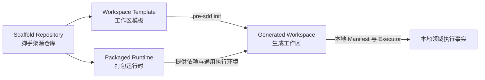

# pre-sdd 脚手架工程标准（Scaffold Engineering Standard）

本文件是脚手架工程边界的面向人权威说明。机器约束由同目录的 Manifest、Schema 与 Validator 实现。

## 四层模型

| 上下文 | 唯一事实来源 | 例子 |
|---|---|---|
| 脚手架源仓库（Scaffold Repository） | 根 `PSPScaffoldProject`、根 Harness、工程测试 | 校验模板纯净性和发布清单 |
| 工作区模板（Workspace Template） | `templates/workspace/` | 初始化时复制的本地 Harness 与领域 Skill |
| 打包运行时（Packaged Runtime） | `bin/`、`runtime/` 与包依赖 | 为本地 Validator 提供 Node.js 依赖 |
| 生成工作区（Generated Workspace） | 目标仓库本地 `PSPProject`、Manifest、Skill、Contract、Schema、Validator | 修改本地产品 Validator 后，下一次执行立即采用该修改 |

核心规则：脚手架仓库生产工作区，模板定义工作区初始形态，全局运行时提供执行环境，生成仓库本地拥有领域 Skill 与执行事实。

## Harness 职责边界

Harness 只拥有与语义和内容效果无关的结构化硬治理：输入输出角色、路径绑定、Scope（范围）、工程命令、生命周期、依赖、验证状态、阻断码公共协议和确定的 handoff（移交）。产品或架构的 Contract、Schema、模板、追溯规则、渲染器和领域 Validator 由生成工作区本地领域 Skill 拥有。

例如，“Manifest 声明的文件路径必须存在”属于 Harness；“Screen（页面）是否覆盖 Wireflow（页面流程）状态”属于 Product Design Skill（产品设计领域 Skill）。

## 脚手架根目录规则

- 根项目类型必须是 `PSPScaffoldProject`，不得声明产品或架构 `stages`。
- 根 `.agents/skills/` 只能包含 Manifest 明确允许的脚手架维护或治理适配 Skill。
- 根 Manifest 只能登记脚手架工程 Scope、命令、验证 Profile 和治理阻断码；不得登记领域 Artifact、领域生命周期或领域 handoff。
- 根 `AGENTS.md` 只说明脚手架维护；不得复制生成工作区的产品交付链。

## 工作区模板规则

- `templates/workspace/` 是生成工作区初始文件的唯一事实来源，不与根目录维护领域 Skill 镜像。
- 模板项目类型必须是 `PSPProject`；所有可用阶段必须为 `uninitialized`。
- 阶段根目录只能包含声明的工作区标记，例如 `.gitkeep`；空骨架不是用户实例。
- 模板不得包含 `node_modules`、构建输出、浏览器证据或任何用户产物实例。
- Product Design 与 Architecture Design 领域 Skill 只保存在模板及生成工作区本地。

## 运行时规则

- Manifest 的 `executor.path` 相对于目标生成工作区解析，实际执行目标工作区本地文件。
- 打包运行时可以提供 Ajv、YAML、Vite、Playwright 等依赖，但不得把 `templates/workspace/` 中的执行器当作目标工作区执行器。
- 运行证据写入操作系统临时目录，不写入模板。

例如，初始化临时工作区后，把本地产品 Validator 改成固定失败；再次运行对应命令必须读到该失败。若命令仍通过，说明运行时错误使用了包内模板副本，应以 `AIH_EXECUTOR_AUTHORITY_INVALID` 阻断。

## 回归门禁

脚手架测试必须在操作系统临时目录中的副本上运行，并至少证明：

1. 根项目不能注册产品或架构阶段。
2. 根目录不能自动发现产品或架构领域 Skill。
3. 模板阶段保持纯净的 `uninitialized` 骨架。
4. 初始化产物包含本地 Harness 与领域 Skill，不包含依赖树和用户实例。
5. 修改生成工作区本地执行器会改变实际命令结果。
6. 发布包只包含运行时、工作区模板、命令行入口和用户文档。
7. 持续集成工作流从 Manifest 读取执行入口，并实际运行 Resolver 返回的全部门禁命令。
