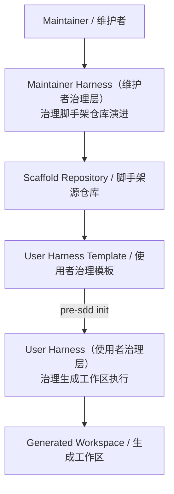
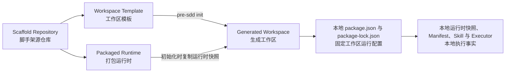

# Harness Standard v3（Harness 上位规范）

<a id="aih-std-authority-001"></a><!-- clause:AIH-STD-AUTHORITY-001 -->

本文件是 `pre-sdd-harness/v3` 的唯一规范权威（Normative Single Source of Truth）。它定义术语、责任、状态、触发时机、证据和合规要求；根 Maintainer Harness、工作区 User Harness、Manifest、Schema、Resolver、Validator、Runtime、Skill、AGENTS、CI Adapter 和文档都只是本规范的上下文投影或执行实现。

具体执行由当前上下文的项目绑定、本地 Manifest、锁文件和本地运行时决定，这些属于运行权威（Runtime Authority）。规范权威定义“什么才合规”，运行权威决定“这次实际执行什么”，二者不得互相替代。当前源码、模板、运行时和发布包只支持 v3；遇到其他协议必须以 `AIH_PROTOCOL_UNSUPPORTED` 阻断，不升级、不迁移、不降级。

本文中的“必须”“不得”是强制要求；“可以”表示合规选择。

<a id="aih-std-terminology-001"></a><!-- clause:AIH-STD-TERMINOLOGY-001 -->

## 核心术语与责任

| 术语 | 定义 | 例子 |
|---|---|---|
| Harness（执行控制体系） | 解析 Scope、规划命令、执行门禁并汇总证据的控制面 | 本地编辑只规划当前 Scope 的 quick 检查 |
| Agent（智能代理） | 理解用户、实施当前授权范围并在停止条件处结束 | preflight 后等待用户确认 |
| Domain Skill（领域 Skill） | 拥有领域 Contract、Schema、工作流和语义 Validator | Product Design 判断用例覆盖率 |
| Artifact Operation（产物操作） | 用户显式请求的原子产物写入 | 修改 Use Cases 权威模型并重建投影 |
| Scope（范围） | 路径、阶段或产物到执行规则的机器绑定 | `visual-spec` Scope |
| Profile（门禁组合） | 有序命令集合及上下文、成本、超时和缓存策略 | `product-handoff` |
| Gate（门禁） | 单项检查及其策略分类 | 路径越界是安全门禁 |
| Blocker（阻断） | 带稳定 `AIH_*` code 的不可继续条件 | `AIH_PATH_OUTSIDE_ROOT` |
| Dependency（依赖） | 下游读取上游事实的数据关系 | Visual Spec 读取 Use Cases |
| Handoff（移交） | 用户允许指定消费者使用固定来源版本的授权关系 | 用户确认 Visual Spec 可消费 Use Cases |
| Handoff Preflight（移交预检） | 在确认前展示固定来源、检查结果与风险 | 输出 token、哈希和 `confirmable` |
| Handoff Receipt（移交凭证） | 绑定来源版本、内容哈希、验证、用户决定和完整性摘要的审计记录 | `.psp/handoffs/receipts/*.json` |
| Consistency Analysis（一致性分析） | 由已登记 Skill 对 Dependency 事实执行的只读诊断 | `project-consistency` |
| Consistency Report（一致性报告） | 包含 dependency、diagnostic、风险和建议操作的标准报告 | 报告引用哈希陈旧但不修复 |

<a id="aih-std-gate-model-001"></a><!-- clause:AIH-STD-GATE-MODEL-001 -->

## Gate 分类与决定权

| Gate 分类 | 本地/Handoff | PR、main、release | 例子 |
|---|---|---|---|
| Safety/Structure Blocker（安全/结构阻断） | 始终不可覆盖 | 始终硬失败 | 路径越界、绑定无效、执行器越权、事务失败、凭证篡改、published 未 Reopen 写入 |
| Domain Diagnostic（领域诊断） | 展示为风险；Handoff 可由用户逐项显式接受 | 严格 Profile 可硬失败 | 覆盖率不足、假设未闭合、视觉偏差 |
| CI/CD Policy Gate（交付策略门禁） | 不由普通编辑自动升级执行 | 按事件上下文硬失败 | PR 受影响范围检查、release 包完整性 |

检查结果与用户决定必须分开：`validation.status` 只允许 `PASS | FAIL | BLOCKED | NOT_RUN`；`decision.status` 表示 `PENDING | CONFIRMED | REJECTED`；`receipt.status` 表示 `NOT_CREATED | VALID | STALE | REVOKED | INVALID`。任何用户风险接受都不能覆盖 Safety/Structure Blocker，也不能改变 CI/CD 的严格结果。

<a id="aih-std-dependency-handoff-001"></a><!-- clause:AIH-STD-DEPENDENCY-HANDOFF-001 -->

## Dependency 与 Handoff 图模型

Dependency 与 Handoff 是正交边，身份按 `from + to + type` 计算；同一节点对可以同时存在两类边。Dependency 才进入数据闭包、拓扑顺序和一致性分析；Handoff 只提供授权候选，不隐含数据依赖，不进入数据影响闭包，也不改变下游生命周期。

例如，`use-cases → visual-spec` 同时声明 Dependency 和 Handoff：前者说明 Visual Spec 读取 Use Cases，后者说明开始消费前需要用户确认。删除其中任一条都不能由另一条补足语义。

<a id="aih-std-consistency-001"></a><!-- clause:AIH-STD-CONSISTENCY-001 -->

通用 Harness 不解释领域 Dependency。`scaffold-consistency` 只读检查脚手架投影，绑定 `PSPScaffoldProject`；`project-consistency` 只读检查生成工作区事实，绑定 `PSPProject`。两者共享 Consistency Report Schema，但不共享项目生命周期、Receipt、用户确认、运行时权威或写权限。用户直接激活 `project-consistency` Skill 必须来自显式请求；Manifest 登记的同名只读 Command 可以由 Handoff Profile 或 CI/CD 严格 Profile 调度。普通编辑与 Hook 不得激活 Skill 或调度该 Command。

<a id="aih-std-handoff-state-001"></a><!-- clause:AIH-STD-HANDOFF-STATE-001 -->

## Handoff 状态机

```text
用户显式请求 Handoff
  → 执行 Preflight，固定来源与 Dependency 闭包哈希
  → 展示 validation、不可接受 blocker、可接受 risks 与 preflight token
  → 停止并等待用户明确 confirm 或 reject
  → confirm 必须提交主体、token，并逐项接受已展示风险
  → 原子写入带完整性摘要的 Receipt
  → downstreamAction: NOT_RUN
```

Receipt 保存在生成工作区本地 `.psp/handoffs/receipts/`。来源、Dependency 内容、Manifest、Profile 或 Standard 版本变化后为 `STALE`；完整性摘要不匹配为 `INVALID`；只有用户显式撤销并提供主体与原因才能转为 `REVOKED`。非法 token、缺失风险接受、结构阻断或非法边都不得生成有效 Receipt。Handoff 在任何状态都不得初始化、修改或执行下游。

<a id="aih-std-execution-evidence-001"></a><!-- clause:AIH-STD-EXECUTION-EVIDENCE-001 -->

## 执行上下文、成本与计划证据

| 执行上下文 | 范围 | 最大成本 | 策略 |
|---|---|---|---|
| `local-edit` | 当前直接 Scope | `quick` | 结构、安全和必要快速检查；不扩展 Dependency |
| `explicit-consistency` | 用户指定 Scope 的 Dependency 影响范围 | `standard` | 只读报告 |
| `handoff` | 来源、来源 Dependency 闭包、指定 Handoff 边 | `standard` | 展示后等待用户决定 |
| `pull-request` | 实际变更影响范围 | `standard` | 合并硬门禁 |
| `main` | 全仓 | `full` | 主干集成硬门禁 |
| `release` | 全仓 readiness、包与发布完整性 | `full` | 显式发布入口硬门禁 |

每个 Command 和 Profile 必须声明允许上下文、`costClass`、稳定超时与缓存策略。Planner 对每条命令必须返回 `selectedBy`、`sourceScope`、`scopeExpansionPath`、`executionContext`、`costClass` 和 cache key/status/reason。一次 Operation 内按 `commandId + inputDigest + profileVersion` 去重；cache key 必须显式记录 `standardDigest`、`profileDigest`、`executorDigest`、`sourceDigest`、`dependencyDigest` 与 `runtimeDigest`，任一变化即失效。Evidence Report 必须通过共享 Schema，记录计划数、实际执行数、缓存命中、`NOT_RUN`、逐项耗时与总耗时；失败后剩余命令为 `NOT_RUN`，超时或预算耗尽以稳定 code 失败，不无限重试。

Agent 在请求完成、遇到不可恢复阻断、需要新用户决定或发现范围外修复时必须停止；不得自动修复、Handoff、发布、Reopen、初始化或开始下游。

<a id="aih-std-dual-harness-001"></a><!-- clause:AIH-STD-DUAL-HARNESS-001 -->

## 双 Harness（双治理层）模型



| 治理层 | 负责 | 不负责 | 例子 |
|---|---|---|---|
| Maintainer Harness（维护者治理层） | 脚手架范围、模板演进、运行时、验证与发布完整性 | 产品内容、架构内容、用户阶段移交 | 修改初始化逻辑后验证模板纯净性与发布包 |
| User Harness（使用者治理层） | 生成工作区本地路径、阶段、依赖、命令、验证状态与内部移交 | 反向治理脚手架源仓库、接管其他工作区 | 用户明确开始用例后，在本地项目绑定范围内执行 |

核心边界：Maintainer Harness 生产正确的模板；User Harness 使用生成后的本地事实执行。两者生命周期隔离，不形成相互控制关系。

<a id="aih-std-runtime-authority-001"></a><!-- clause:AIH-STD-RUNTIME-AUTHORITY-001 -->

## 四层模型



| 上下文 | 唯一事实来源 | 例子 |
|---|---|---|
| 脚手架源仓库（Scaffold Repository） | 根 `PSPScaffoldProject`、Maintainer Harness、工程测试 | 校验模板纯净性和发布清单 |
| 工作区模板（Workspace Template） | `templates/workspace/` | 初始化时复制的 User Harness 与领域 Skill |
| 打包运行时（Packaged Runtime） | `bin/`、`runtime/` 与包依赖 | 生成未来的新工作区，并复制当前版本运行时快照 |
| 生成工作区（Generated Workspace） | 本地 `PSPProject`、`.psp/runtime/pre-sdd/`、`package.json`、`package-lock.json`、Manifest、Skill、Contract、Schema 与 Validator | 全局工具更新后仍按自己的运行时快照与锁定依赖运行 |

生成仓库本地拥有运行配置、领域 Skill 与执行事实；全局工具和根 Harness 不得替代这些本地事实。

<a id="aih-std-completion-001"></a><!-- clause:AIH-STD-COMPLETION-001 -->

## 角色与当前移交

| 角色 | 输入 | 受什么约束 | 输出 |
|---|---|---|---|
| 维护者（Maintainer） | 仓库变更请求 | Maintainer Harness | 已验证脚手架变更 |
| 使用者（User） | 明确的当前产物请求 | 生成工作区本地 User Harness | 当前范围内的工作区产物与验证结果 |

根仓库的 Maintainer Completion（维护者完成证据）只表示“变更已通过脚手架工程门禁，可由维护者决定是否合并”。它不是 Handoff，不是用户内容，也不产生产品或架构移交凭证。根 Manifest 只能登记脚手架工程 Scope、命令、验证 Profile 与阻断码。

## 双角色典型用例

以下用例是既有 Manifest、项目绑定与 Harness 协议的面向人投影，不建立新的机器规则。Maintainer Harness 与 User Harness 面向不同执行上下文；相同的“验证通过”在两层中也不产生相同凭证。

### 维护者（Maintainer）用例

| 用例 | 维护者动作 | Maintainer Harness 动作 | 结果 | 明确不发生 |
|---|---|---|---|---|
| 修改工作区模板 | 修改 `templates/workspace/` 中的 User Harness、领域 Skill 或初始文件 | 按变更路径解析模板 Scope；检查 `PSPProject` 绑定、`uninitialized` 骨架、模板纯净性与双 Harness 隔离；在操作系统临时目录的模板副本或生成工作区执行相应回归 | 变更只影响未来由该版本生成的新工作区 | 不在模板原位创建用户实例，不更新既有工作区 |
| 修改打包运行时 | 修改 `bin/`、`runtime/`、包依赖或初始化逻辑 | 校验运行时快照、目标工作区本地执行器权威、依赖锁与初始化事务；执行包级测试 | 新版本能够生成固定运行配置的工作区 | 不接管已经生成的工作区，不提供升级、迁移或同步 |
| 建立工程检查点 | 完成本地编辑、提交 PR 或 push 到 `main` | 分别以 `local-edit`、`pull-request` 或 `main` 解析 Scope，并按 Manifest 顺序执行工程命令 | 当前工程影响范围获得 `PASS`、`FAIL`、`BLOCKED` 或 `NOT_RUN` 证据 | `checkpointProfile` 只是 PR Profile 字段，不是执行上下文；不形成发布凭证，不执行产品或架构 handoff |
| 执行发布前验证 | 通过隔离的 Release workflow 请求发布检查 | 以 `release` 上下文执行完整脚手架治理、包、安装、构建与发布清单门禁 | 全部 `PASS` 后可以形成 `validated-scaffold-change` | 不自动合并、打标签、发布或部署 |

例如，维护者修改 Product Design Skill 模板时，Maintainer Harness 将变更归入产品模板 Scope，在临时生成工作区运行相应领域回归；通过只表示模板工程影响范围有效，不表示任何用户产品内容就绪。

### 工作区使用者（User）用例

| 用例 | 使用者动作 | User Harness 动作 | 结果 | 明确不发生 |
|---|---|---|---|---|
| 创建生成工作区 | 执行 `pre-sdd init .` | 复制工作区模板与当前版本运行时快照；绑定本地 Manifest、`package.json` 和 `package-lock.json`；创建阶段空骨架并验证 | 得到由本地事实治理、全部可用阶段为 `uninitialized` 的工作区 | 不创建产品或架构用户实例 |
| 明确开始领域阶段 | 请求开始 Product Design 或独立的 Architecture Design | 执行本地 Manifest 登记的阶段初始化 operation；检查状态与路径冲突；运行登记命令并在失败时回滚 | 对应阶段进入可工作的本地状态 | 不因目录存在或一句需求自动初始化其他阶段 |
| 更新当前产物 | 请求修改 Use Cases、Visual Spec、Canonical UI Prototype 或架构产物 | 解析当前 Artifact Scope；检查阶段状态与 DAG 依赖；通过登记的 artifact operation 同步权威模型和投影；调用领域 Validator 并汇总结果 | 当前产物获得可追溯的变更与验证证据 | Harness 不解释或补写产品、视觉与架构语义，不扩展到未请求产物 |
| 发布或重新打开 Product Design | 明确请求 Publish 或 Reopen | Publish 执行登记的严格 Profile、核对评审证据并原子写入发布凭证与 `published` 状态；Reopen 保存发布历史并恢复可修改状态 | 产品阶段被锁定，或在保留历史后重新进入修改周期 | 不初始化 Architecture Design，不触发工作区外移交 |
| 执行内部 handoff | 明确指定来源 Scope 与目标 Scope，并在查看 preflight 后确认或拒绝 | 检查显式 `handoff` 边；固定来源与 Dependency 哈希；按 Profile 展示验证和风险；校验确认主体与 token；确认后持久化可审计 Receipt | 验证状态、用户决定与 Receipt 状态分别记录 | 不让 Handoff 充当 Dependency，不初始化、修改或运行下游 |

工作区中的阶段、Artifact、Publish、Reopen 与 handoff 操作只能从生成工作区本地 Manifest 解析。模板当前是否声明具体消费者属于 User Harness 的本地机器事实；Manifest 没有声明消费者时，当前范围在验证后结束。

<a id="aih-std-command-surface-001"></a><!-- clause:AIH-STD-COMMAND-SURFACE-001 -->

## 用户命令面与工作区生命周期

面向用户的公共操作只有三项：

| 用户操作 | 命令示例 | 影响范围 |
|---|---|---|
| 安装 `pre-sdd` | `npm install --global git+https://github.com/bigsmartben/pre-sdd.git` | 安装创建新工作区的工具 |
| 更新 `pre-sdd` | `npm install --global git+https://github.com/bigsmartben/pre-sdd.git` | 重新安装最新版工具，只影响以后创建的新工作区 |
| 初始化工作区 | `pre-sdd init .` | 在目标目录生成一个固定版本的工作区 |

`pre-sdd harness` 是 Agent（智能代理）与 Harness Adapter（治理适配器）的内部调度入口，不属于公共用户接口。

既有工作区不提供 update（更新）、upgrade（升级）、migrate（迁移）或 sync（同步）操作。生成后，本地 `package.json` 与 `package-lock.json` 固定运行依赖和命令入口，本地 Manifest、Skill、Contract、Schema 与 Validator 固定执行事实；全局工具后续更新不得自动接管。

例如，版本甲生成 `product-a`，版本乙生成 `product-b`；两个工作区各自使用初始化时写入的本地运行配置，版本乙不得改写 `product-a`。

<a id="aih-std-responsibility-001"></a><!-- clause:AIH-STD-RESPONSIBILITY-001 -->

## Harness 职责边界

Harness 只拥有与内容语义无关的结构化硬治理：输入输出角色、路径绑定、Scope（范围）、工程命令、生命周期、关系登记、验证状态与阻断码。Dependency 的领域含义由已登记的一致性或领域 Skill 解释；领域 Contract、Schema、模板、追溯规则、渲染器和领域 Validator 由生成工作区本地领域 Skill 拥有。

例如，“Manifest 声明的文件路径必须存在”属于 Harness；“页面是否覆盖页面流程中的全部状态”属于 Product Design Skill（产品设计领域 Skill）。

<a id="aih-std-root-boundary-001"></a><!-- clause:AIH-STD-ROOT-BOUNDARY-001 -->

## 脚手架根目录规则

- 根项目类型必须是 `PSPScaffoldProject`，不得声明产品或架构 `stages`。
- 根 `.agents/skills/` 只能包含 Manifest 允许的维护或治理 Skill。
- 根 Manifest 不得登记领域 Artifact、领域生命周期或领域 handoff。
- 根 `AGENTS.md` 只说明脚手架维护，不复制生成工作区的产品交付规则。
- 根验证通过只形成已验证脚手架变更，不表示任何用户产物就绪。

<a id="aih-std-template-boundary-001"></a><!-- clause:AIH-STD-TEMPLATE-BOUNDARY-001 -->

## 工作区模板规则

- `templates/workspace/` 是 User Harness 与生成工作区初始文件的唯一模板来源。
- 模板项目类型必须是 `PSPProject`；全部可用阶段必须为 `uninitialized`。
- 阶段根目录只能包含 Manifest 声明的工作区标记，例如 `.gitkeep`。
- 模板不得包含用户实例、`node_modules`、构建输出、浏览器证据或运行证据。
- 产品设计与架构设计领域 Skill 只保存在模板及生成工作区本地。
- 当前仓库不得在模板、文档或 Manifest 中绑定范围外的外部框架。

<a id="aih-std-runtime-rules-001"></a><!-- clause:AIH-STD-RUNTIME-RULES-001 -->

## 运行时规则

- 全局 `pre-sdd` 只拥有新工作区生成能力；初始化成功后不再是该工作区的运行权威。
- 初始化必须把当前版本命令分发运行时复制到生成工作区的 `.psp/runtime/pre-sdd/`；工作区命令不得回退到后来更新的全局入口。
- 工作区本地 `package.json` 与 `package-lock.json` 是运行依赖与命令解析的唯一事实来源。
- Manifest 的 `executor.path` 相对于目标生成工作区解析，实际执行目标工作区本地文件。
- 不得把 `templates/workspace/` 中的执行器当作目标工作区执行器；违反时以 `AIH_EXECUTOR_AUTHORITY_INVALID` 阻断。
- 运行证据写入操作系统临时目录，不写入模板。

<a id="aih-std-ci-cd-001"></a><!-- clause:AIH-STD-CI-CD-001 -->

## 回归与持续集成门禁

脚手架测试必须在操作系统临时目录中的模板副本或生成工作区上运行，并至少证明：

| 意图 | 用途 | 证据边界 |
|---|---|---|
| `local-edit` | 编辑循环的当前 Scope 快速结构反馈 | 不形成完成凭证 |
| `pull-request` | PR 实际变更影响范围的工程检查点 | 不形成发布凭证 |
| `main` | push 到 `main` 的全仓工程检查点 | 不形成发布凭证 |
| `release` | 仅显式发布入口运行的完整包、安装、构建与治理门禁 | PASS 后可形成 `validated-scaffold-change` |

1. 根项目不能注册产品或架构阶段与移交边。
2. Maintainer Harness 与 User Harness 的项目类型、权威来源和生命周期相互隔离。
3. 模板阶段保持纯净的 `uninitialized` 骨架。
4. 初始化产物包含本地 User Harness 与领域 Skill，不包含依赖树和用户实例。
5. 修改生成工作区本地执行器会改变实际命令结果。
6. 范围外的外部框架引用会被稳定阻断。
7. 发布包只包含运行时、工作区模板、命令行入口和用户文档。
8. PR、main 与 Release Adapter 从 Manifest 读取统一执行器，分别显式请求 `pull-request`、`main` 与 `release`；普通 CI 不得生成发布凭证。
