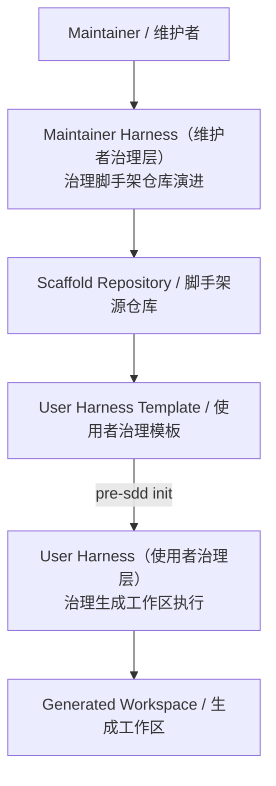
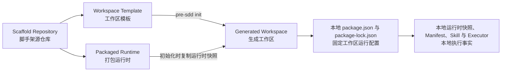

# pre-sdd 脚手架双治理标准（Scaffold Dual-Harness Standard）

本文件是脚手架工程边界的面向人权威说明。机器约束由同目录的 Manifest、Schema 与 Validator 实现。

## 双 Harness（双治理层）模型

| 治理层 | 负责 | 不负责 | 例子 |
|---|---|---|---|
| Maintainer Harness（维护者治理层） | 脚手架范围、模板演进、运行时、验证与发布完整性 | 产品内容、架构内容、用户阶段移交 | 修改初始化逻辑后验证模板纯净性与发布包 |
| User Harness（使用者治理层） | 生成工作区本地路径、阶段、依赖、命令、验证状态与内部移交 | 反向治理脚手架源仓库、接管其他工作区 | 用户明确开始用例后，在本地项目绑定范围内执行 |

核心边界：Maintainer Harness 生产正确的模板；User Harness 使用生成后的本地事实执行。两者生命周期隔离，不形成相互控制关系。

## 四层模型

| 上下文 | 唯一事实来源 | 例子 |
|---|---|---|
| 脚手架源仓库（Scaffold Repository） | 根 `PSPScaffoldProject`、Maintainer Harness、工程测试 | 校验模板纯净性和发布清单 |
| 工作区模板（Workspace Template） | `templates/workspace/` | 初始化时复制的 User Harness 与领域 Skill |
| 打包运行时（Packaged Runtime） | `bin/`、`runtime/` 与包依赖 | 生成未来的新工作区，并复制当前版本运行时快照 |
| 生成工作区（Generated Workspace） | 本地 `PSPProject`、`.psp/runtime/pre-sdd/`、`package.json`、`package-lock.json`、Manifest、Skill、Contract、Schema 与 Validator | 全局工具更新后仍按自己的运行时快照与锁定依赖运行 |

生成仓库本地拥有运行配置、领域 Skill 与执行事实；全局工具和根 Harness 不得替代这些本地事实。

## 角色与当前移交

| 角色 | 输入 | 受什么约束 | 输出 |
|---|---|---|---|
| 维护者（Maintainer） | 仓库变更请求 | Maintainer Harness | 已验证脚手架变更 |
| 使用者（User） | 明确的当前产物请求 | 生成工作区本地 User Harness | 当前范围内的工作区产物与验证结果 |

根仓库的 Maintainer Handoff（维护者移交）只表示“变更已通过脚手架工程门禁，可由维护者决定是否合并”。它不是用户内容，也不产生产品或架构移交凭证。根 Manifest 只能登记脚手架工程 Scope、命令、验证 Profile 与阻断码。

## 用户命令面与工作区生命周期

面向用户的公共操作只有三项：

| 用户操作 | 命令示例 | 影响范围 |
|---|---|---|
| 安装 `pre-sdd` | `npm install --global git+https://github.com/bigsmartben/pre-sdd.git` | 安装创建新工作区的工具 |
| 更新 `pre-sdd` | `npm install --global git+https://github.com/bigsmartben/pre-sdd.git` | 重新安装最新版工具，只影响以后创建的新工作区 |
| 初始化工作区 | `pre-sdd init .` | 在目标目录生成一个固定版本的工作区 |

`pre-sdd harness` 是 Agent（智能代理）与 Harness Adapter（治理适配器）的内部调度入口，不属于公共用户接口。

既有工作区不提供 update（更新）、upgrade（升级）、migrate（迁移）或 sync（同步）操作。生成后，本地 `package.json` 与 `package-lock.json` 固定运行依赖和命令入口，本地 Manifest、Skill、Contract、Schema 与 Validator 固定执行事实；全局工具后续更新不得自动接管。

例如，版本甲生成 `product-a`，版本乙生成 `product-b`；两个工作区各自使用初始化时写入的本地运行配置，版本乙不得改写 `product-a`。

## Harness 职责边界

Harness 只拥有与内容语义无关的结构化硬治理：输入输出角色、路径绑定、Scope（范围）、工程命令、生命周期、依赖、验证状态与阻断码。领域 Contract、Schema、模板、追溯规则、渲染器和领域 Validator 由生成工作区本地领域 Skill 拥有。

例如，“Manifest 声明的文件路径必须存在”属于 Harness；“页面是否覆盖页面流程中的全部状态”属于 Product Design Skill（产品设计领域 Skill）。

## 脚手架根目录规则

- 根项目类型必须是 `PSPScaffoldProject`，不得声明产品或架构 `stages`。
- 根 `.agents/skills/` 只能包含 Manifest 允许的维护或治理 Skill。
- 根 Manifest 不得登记领域 Artifact、领域生命周期或领域 handoff。
- 根 `AGENTS.md` 只说明脚手架维护，不复制生成工作区的产品交付规则。
- 根验证通过只形成已验证脚手架变更，不表示任何用户产物就绪。

## 工作区模板规则

- `templates/workspace/` 是 User Harness 与生成工作区初始文件的唯一模板来源。
- 模板项目类型必须是 `PSPProject`；全部可用阶段必须为 `uninitialized`。
- 阶段根目录只能包含 Manifest 声明的工作区标记，例如 `.gitkeep`。
- 模板不得包含用户实例、`node_modules`、构建输出、浏览器证据或运行证据。
- 产品设计与架构设计领域 Skill 只保存在模板及生成工作区本地。
- 当前仓库不得在模板、文档或 Manifest 中绑定范围外的外部框架。

## 运行时规则

- 全局 `pre-sdd` 只拥有新工作区生成能力；初始化成功后不再是该工作区的运行权威。
- 初始化必须把当前版本命令分发运行时复制到生成工作区的 `.psp/runtime/pre-sdd/`；工作区命令不得回退到后来更新的全局入口。
- 工作区本地 `package.json` 与 `package-lock.json` 是运行依赖与命令解析的唯一事实来源。
- Manifest 的 `executor.path` 相对于目标生成工作区解析，实际执行目标工作区本地文件。
- 不得把 `templates/workspace/` 中的执行器当作目标工作区执行器；违反时以 `AIH_EXECUTOR_AUTHORITY_INVALID` 阻断。
- 运行证据写入操作系统临时目录，不写入模板。

## 回归与持续集成门禁

脚手架测试必须在操作系统临时目录中的模板副本或生成工作区上运行，并至少证明：

1. 根项目不能注册产品或架构阶段与移交边。
2. Maintainer Harness 与 User Harness 的项目类型、权威来源和生命周期相互隔离。
3. 模板阶段保持纯净的 `uninitialized` 骨架。
4. 初始化产物包含本地 User Harness 与领域 Skill，不包含依赖树和用户实例。
5. 修改生成工作区本地执行器会改变实际命令结果。
6. 范围外的外部框架引用会被稳定阻断。
7. 发布包只包含运行时、工作区模板、命令行入口和用户文档。
8. 持续集成工作流从 Manifest 读取统一执行器，再按 Resolver 返回顺序实际执行全部命令。
