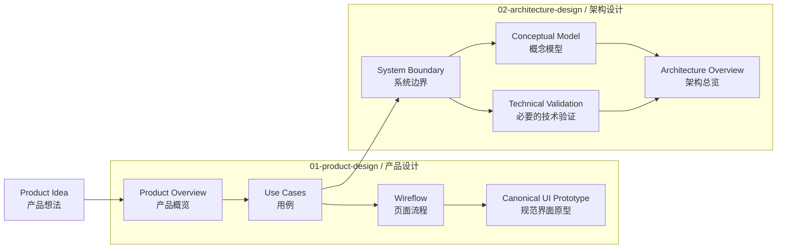
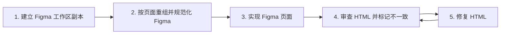

# pre-sdd 快速开始（Quickstart）

本文采用使用者视角（User View），重点说明创建工作区后，你怎样完成 `01-product-design`（产品设计）和 `02-architecture-design`（架构设计）。你不需要了解内部实现，只需要一次明确一个目标、评审结果，再决定下一步。

## 整个使用流程



你只需要记住三点：

1. 每次只让智能代理完成一个明确目标，不会自动开始下一步。
2. 用例完成后，可以选择继续做界面，也可以开始架构设计。
3. 架构设计只需要已经确认并检查通过的 Use Cases（用例），不要求先完成页面流程和界面原型。

## 会改变状态的公共操作只有三项

| 操作 | 命令 | 什么时候用 |
|---|---|---|
| 安装 `pre-sdd` | `npm install --global git+https://github.com/bigsmartben/pre-sdd.git` | 第一次使用 |
| 更新 `pre-sdd` | `npm update --global pre-sdd` | 为以后创建的新工作区更新工具 |
| 创建工作区 | `pre-sdd init .` | 在准备好的目录中执行一次 |

准备一个新目录并创建工作区：

```bash
mkdir my-product
cd my-product
git init
pre-sdd init .
```

完成后会看到两个目录：

| 目录 | 用来做什么 | 初始状态 |
|---|---|---|
| `01-product-design` | 产品概览、用例、页面流程和界面原型 | 尚未开始 |
| `02-architecture-design` | 系统边界、概念模型、技术验证和架构总览 | 尚未开始 |

打开这个工作区，然后从产品概览开始。目录或文件存在不等于内容已经完成；以智能代理本轮的检查结果为准。

## 01-product-design：先把产品说清楚

### 第一步：产品概览

先说明产品想法、目标使用者和要解决的问题。

```text
请开始 Product Overview（产品概览）。
产品想法：为小型团队提供一个按项目汇总客户反馈的工具。
目标使用者：需要统一收集和跟进反馈的项目负责人。
本轮只完成产品概览，不要开始用例或架构设计。
```

你将评审 `01-product-design/PSP.md`。确认结果符合预期后，再明确开始用例。

### 第二步：用例

用例描述使用者在什么情况下、为了什么目标、怎样使用产品。

```text
请根据已经确认的产品概览开始 Use Cases（用例）。
重点覆盖：收集反馈、合并重复反馈、按项目查看处理状态。
本轮只完成用例，不要开始页面流程或架构设计。
```

你将评审 `01-product-design/UC.md`。用例完成后，有两个选择：

| 你接下来想做什么 | 告诉智能代理 |
|---|---|
| 继续设计界面 | “开始 Wireflow（页面流程）。” |
| 开始架构设计 | “开始 Architecture Design（架构设计）。” |

两条路线都可以做，但每次只明确开始一条。

### 第三步：页面流程

页面流程说明使用者会看到哪些页面、怎样操作，以及成功、失败和返回时会发生什么。

```text
请根据已经确认的用例开始 Wireflow（页面流程）。
请覆盖正常流程、空状态、失败状态和恢复路径。
本轮只完成页面流程，不要开始界面原型。
```

你将评审 `01-product-design/wireflow-mid.md`。确认页面流程后，再开始规范界面原型。

### 第四步：规范界面原型

开始前，请说明主要在哪种设备上使用。如果没有说明，智能代理会先提供容易选择的答案，不会直接开始生成：

- 电脑网页（推荐）
- 15 寸平板
- 手机
- 我说具体设备

选择平板后，如果方向会影响界面，智能代理会继续确认横屏或竖屏。默认只做你选中的环境，不会顺手增加其他设备版本或额外检查。

```text
请根据已经确认的页面流程开始 Canonical UI Prototype（规范界面原型）。
主要用于电脑网页。本轮不做手机和平板版本。
```

界面生成并检查通过后，智能代理会启动本地 HTTP Server（超文本传输协议服务器），确认地址能够打开，然后直接提供可点击的评审地址。你不需要自己运行内部命令。

### 用 Figma 快速还原页面

如果已有 Figma 设计，按下面的闭环（feedback loop，反馈循环）推进。每一步只做该步的事；特别是复制、整理和新建组件会写入 Figma，必须先由你确认目标文件与页面范围。



| 步骤 | 你要确认或提供什么 | 智能代理完成什么 | 产出 |
|---|---|---|---|
| 1. 建立副本 | 原始 Figma 文件、要复制的页面，以及新副本的归属 | 建立独立的 Figma 工作区副本，保留原稿不被后续整理影响 | 可编辑的副本与明确页面范围 |
| 2. 页面重组 | 哪些页面要实现、哪些组件可以复用 | 按页面整理图层、命名、Auto Layout（自动布局）、组件与 `Export/` 资源；全部 Figma 写入完成后冻结节点 | 可采集的最终页面节点 |
| 3. 实现 | 目标页面与视觉策略 | 采集冻结节点、截图、变量和资源证据，导出资源，并实现 Lit + Vite 页面 | 可运行的 Canonical UI Prototype（规范界面原型） |
| 4. 审查 HTML | 在浏览器中实际操作页面，并指出与 Figma 的差异 | 打开带不一致标记工具的评审地址，记录截图、区域和差异类别 | 可交给修复的差异说明 |
| 5. 修复 HTML | 确认本轮应修复的差异 | 仅在允许范围内修改 HTML/CSS/组件实现，重新检查并提供新的评审地址 | 新一轮可审查页面 |

例如，先这样发起第一轮：

```text
请为这个 Figma 设计建立工作区副本，并只重组“订单详情”页面。
请统一图层命名、整理可复用组件和导出资源；完成后冻结页面节点，
不要开始实现 HTML。
```

冻结并实现后，打开下方的评审地址进行第 4 步。标记问题后，只要求修复当前问题，再回到第 4 步复查，直到你确认没有需要继续修复的差异。

地址类似：

```text
http://localhost:4173/?annotate=1
```

端口以智能代理实际提供的地址为准。`annotate=1` 表示默认打开不一致标记工具；它不会改变正式界面规格。

打开地址后，你可以直接操作完整界面，也可以使用不一致标记工具反馈问题：

1. 点击“开始框选”。
2. 拖动鼠标框住问题区域。
3. 选择“位置／尺寸”“文字错误”“交互错误”或“看起来不一样”。
4. 点击“复制”，把带标记的截图直接粘贴给智能代理。

例如，你可以标记项目列表区域，再说明：“列表为空时缺少下一步引导。”智能代理应只修正你指出的问题，然后重新检查并提供新的可执行地址。

## 02-architecture-design：把实现方向说清楚

只有用例已经确认并检查通过后，才能开始架构设计。页面流程和界面原型尚未完成，不会阻止架构设计。

```text
请根据已经确认的 Use Cases 开始 Architecture Design（架构设计）。
先明确系统边界和核心概念，只对确实存在风险的技术选择做验证，最后形成架构总览。
如果产品信息不足，请列出缺口，不要自行改变产品设计。
```

架构设计会围绕以下产物展开。其中，概念模型和必要的技术验证都以已确认的系统边界为基础，可以分别进行；最后再汇总为架构总览：

| 产物 | 需要回答的问题 | 你评审的文件 |
|---|---|---|
| System Boundary（系统边界） | 系统负责什么、不负责什么，与外部对象怎样协作 | `02-architecture-design/系统边界.md` |
| Conceptual Model（概念模型） | 核心概念有哪些，它们之间是什么关系 | `02-architecture-design/概念建模.md` |
| Technical Validation（技术验证） | 哪些高风险选择需要先用小实验确认 | `02-architecture-design/技术验证/README.md` |
| Architecture Overview（架构总览） | 前面的结论怎样组成完整、可评审的实现方向 | `02-architecture-design/README.md` |

技术验证不是越多越好，只需要验证那些会影响关键选择、而且暂时无法仅靠讨论确定的问题。

架构总览完成并检查通过后，当前工作区流程结束。是否进入开发或其他后续工作，由你另行决定。

## 每一轮你只需要做三件事

1. 说明本轮要完成什么，并明确不做什么。
2. 回答智能代理提出的必要问题。
3. 评审结果，然后决定是否开始下一步。

如果结果不符合预期，直接指出具体问题并要求修改当前产物，不必急着进入下一步。例如：

```text
当前用例没有覆盖“反馈被误合并后如何恢复”。
请只补充这个缺口并重新检查用例，不要开始页面流程。
```

## 常见疑问

| 情况 | 说明 |
|---|---|
| 两个目录里只有空标记 | 正常。只有你明确开始后，智能代理才会创建内容。 |
| 开始产品概览后出现了其他空文件 | 正常。文件存在不等于对应步骤已经完成。 |
| 智能代理说上一步还不能通过 | 先修正上一步列出的缺口，不要跳过。 |
| 用例完成后必须先做界面吗 | 不必须。可以直接开始架构设计。 |
| 界面地址打不开 | 请智能代理重新启动本地服务并提供实际可访问地址；不要用本地 HTML 文件路径代替。 |
| 为什么界面地址带有 `annotate=1` | 它用于默认打开不一致标记工具，方便框选问题并复制带标记截图。 |
| 更新全局 `pre-sdd` 会改变旧工作区吗 | 不会。更新只影响以后创建的新工作区。 |

如果安装或创建工作区失败，请保留完整错误信息并交给脚手架维护者处理，不要手工补写缺失文件。
