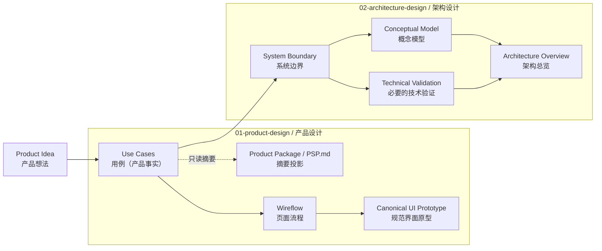

# pre-sdd 快速开始（Quickstart）

本文采用使用者视角（User View），重点说明创建工作区后，你怎样完成 `01-product-design`（产品设计）和 `02-architecture-design`（架构设计）。你不需要了解内部实现，只需要一次明确一个目标、评审结果，再决定下一步。

## 整个使用流程



你只需要记住三点：

1. 每次只让智能代理完成一个明确目标，不会自动开始下一步。
2. 用例完成后，可以选择继续做界面，也可以开始架构设计。
3. 架构设计只需要已经确认并检查通过的 Use Cases（用例），不要求先完成页面流程和界面原型。

## 会改变状态的公共操作只有三项

| 操作 | 命令 | 什么时候用 |
|---|---|---|
| 安装 `pre-sdd` | `npm install --global git+https://github.com/bigsmartben/pre-sdd.git` | 第一次使用 |
| 更新 `pre-sdd` | `npm install --global git+https://github.com/bigsmartben/pre-sdd.git` | 为以后创建的新工作区重新安装最新版工具 |
| 创建工作区 | `pre-sdd init .` | 在准备好的目录中执行一次 |

准备一个新目录并创建工作区：

```bash
mkdir my-product
cd my-product
git init
pre-sdd init .
```

完成后会看到两个目录：

| 目录 | 用来做什么 | 初始状态 |
|---|---|---|
| `01-product-design` | 用例、产品摘要、页面流程和界面原型 | 尚未开始 |
| `02-architecture-design` | 系统边界、概念模型、技术验证和架构总览 | 尚未开始 |

打开这个工作区，然后从 Use Cases（用例）开始。目录或文件存在不等于内容已经完成；以智能代理本轮的检查结果为准。

## 01-product-design：先把产品说清楚

### 第一步：用例

用例同时记录产品名称、产品意图、Actor（参与者）、产品范围、业务规则、场景和验收条件，是产品设计的首个权威产物。

```text
请根据下面的产品想法开始 Use Cases（用例）。
产品名称：反馈管家。
产品想法：为小型团队提供一个按项目汇总客户反馈的工具。
重点覆盖：收集反馈、合并重复反馈、按项目查看处理状态。
本轮只完成用例，不要开始页面流程或架构设计。
```

你将评审完整的 `01-product-design/UC.md`，以及由同一份 Use Cases 权威模型自动生成的 `01-product-design/PSP.md` 摘要。`PSP.md` 不能单独修改；修改用例时两份 Markdown 会在同一产物事务中同步更新。用例完成后，有两个选择：

| 你接下来想做什么 | 告诉智能代理 |
|---|---|
| 继续设计界面 | “开始 Wireflow（页面流程）。” |
| 开始架构设计 | “开始 Architecture Design（架构设计）。” |

两条路线都可以做，但每次只明确开始一条。

Use Cases 完成时只形成到 Wireflow 的产品设计移交；如果你选择架构设计，Architecture Design 会独立检查同一份 Use Cases 是否仍然通过严格门禁，不把架构路线伪装成产品设计 handoff。

### 第二步：页面流程

页面流程说明使用者会看到哪些页面、怎样操作，以及成功、失败和返回时会发生什么。

```text
请根据已经确认的用例开始 Wireflow（页面流程）。
请覆盖正常流程、空状态、失败状态和恢复路径。
本轮只完成页面流程，不要开始界面原型。
```

你将评审 `01-product-design/wireflow-mid.md`。确认页面流程后，再开始规范界面原型。

### 第三步：规范界面原型

开始前，请说明主要在哪种设备上使用。如果没有说明，智能代理会先提供容易选择的答案，不会直接开始生成：

- 电脑网页（推荐）
- 15 寸平板
- 手机
- 我说具体设备

选择平板后，如果方向会影响界面，智能代理会继续确认横屏或竖屏。默认只做你选中的环境，不会顺手增加其他设备版本或额外检查。

```text
请根据已经确认的页面流程开始 Canonical UI Prototype（规范界面原型）。
主要用于电脑网页。本轮不做手机和平板版本。
```

界面生成并检查通过后，智能代理会启动本地 HTTP Server（超文本传输协议服务器），确认地址能够打开，然后直接提供可点击的评审地址。你不需要自己运行内部命令。

### 用 Figma 快速还原页面

如果已有 Figma 设计，请把 Figma 当作界面视觉来源，而不是产品需求来源：产品目标、权限和业务规则仍以已经确认的 Use Cases（用例）为准，页面、操作和状态仍以已经确认的 Wireflow（页面流程）为准。

开始前先准备下面的信息。缺少任何一项，都先补齐再要求智能代理写入 Figma 或实现页面：

| 你要准备什么 | 具体内容 | 示例 |
|---|---|---|
| 原始设计 | 可以打开的 Figma 文件或具体 Frame（画框）链接 | “客户反馈台”文件中的“项目列表”Frame |
| 本轮范围 | 要处理的页面、状态和明确不处理的内容 | 只处理项目列表与反馈详情；不处理手机稿 |
| 运行环境 | 页面主要在哪种设备上使用 | 电脑网页，视口以 Figma 桌面 Frame 为准 |
| 视觉目标 | 是完全还原，还是只参考部分风格 | 完全还原页面布局、字体、颜色和资源 |
| 写入位置 | Figma 副本放在哪个 Team（团队）或 Project（项目）中 | `Feedback Manager / UI Rebuild` |
| 编辑权限 | 智能代理可以编辑副本，但不能修改原始设计 | 原稿只读，副本可编辑 |

整个过程按下面 7 步推进。第 1、2 步会修改 Figma；第 3 步冻结节点后，不再整理图层或修改组件。只要 Figma 再次发生写入，就必须回到第 3 步重新冻结并采集。


#### 这 7 步由哪些工作区技能执行

用户不需要手工运行技能内部命令，只需要说清楚当前步骤和范围，智能代理就应按下面的顺序加载工作区本地 Skill（技能）。这些技能不是可以互相替代的通用工具：每个技能只负责闭环中的一段。

| 工作区 Skill（技能） | 对应步骤 | 负责什么 | 明确不负责什么 |
|---|---|---|---|
| `product-design` | 开始前、第 4、6、7 步 | 确认运行环境与 `exact` / `guided` 视觉策略；用 Use Cases 和 Wireflow 约束界面语义；登记来源、组件映射并执行浏览器验收 | 不直接整理 Figma，不代替独立视觉修复技能修改代码 |
| `apply-repository-harness` | 所有会写入工作区的步骤 | 根据当前工作区 Manifest（清单）解析允许路径、前置依赖和必须执行的验证 | 不决定产品语义，也不替用户确认范围 |
| `organize-figma-assets` | 第 2 步的页面整理部分 | 盘点范围、分离已确认的 Instance、重命名和重排图层、复用已有组件、标记 `Export/` 资源 | 不创建 Component、Variant 或 Variable（变量） |
| `figma-component-from-design` | 第 2 步的组件重建部分 | 提出并等待用户确认组件模型，再创建组件、有限 Variant、属性、变量和 Lit 接口交接映射 | 不修改 Product Design 产物，不把创建前节点当作最终来源证据 |
| `capture-figma-design-source` | 第 3、4 步 | 冻结带 `node-id` 的最终节点，采集设计上下文、同节点截图、字体、变量、组件关系、资源和哈希证据 | 不整理 Figma，不决定业务状态或视觉策略 |
| `implement-figma-lit-page` | 第 5 步 | 消费已登记的最终证据，先实现共享 Lit 组件，再组装页面、路由与状态 | 不边实现边补采集，不在页面里绕过组件映射 |
| `repair-canonical-ui-visual` | 第 7 步中符合条件的视觉差异 | 只根据 Repair Packet（修复包）修改允许路径，并重新执行同一视觉门禁 | 不修改 Figma 基线、Use Cases、Wireflow、容差或视觉策略 |

例如，第 2 步不能只说“整理并组件化”：智能代理应先用 `organize-figma-assets` 整理普通图层和已有组件；确实需要新建组件时，再切换到 `figma-component-from-design`，提出组件名、属性、Variant、变量和嵌套边界，等你确认后才写入。

#### 第一步：创建 Figma 副本工作区

先保留原始设计，再创建专门用于整理和实现的副本。不要直接在原稿上重命名图层、分离 Instance（实例）或创建组件。

这一步由你确认副本归属和编辑权限；工作区技能不能替你决定 Team / Project。进入 Figma 写入前，`product-design` 应先确认本轮页面、运行环境和视觉目标，`apply-repository-harness` 应确认当前工作区允许开始 Canonical UI Prototype（规范界面原型）相关工作。

你可以在 Figma 中打开原始文件，选择 Duplicate（创建副本），把副本移动到目标 Team / Project，并按“产品名 + UI Rebuild”命名。如果原始文件不能直接复制，就新建一个空白文件，只把本轮确认的页面复制进去。然后把原稿链接、副本链接和本轮页面范围一起交给智能代理。

```text
请以这个原始 Figma 文件为只读对照：<原稿链接>。
请在 <Team / Project 名称> 中创建或使用副本“反馈管家 UI Rebuild”。
本轮只处理“项目列表”和“反馈详情”两个页面；不要修改原稿，
主要用于电脑网页，按 Figma 完全还原。请先使用 product-design 确认范围和视觉策略，
不要复制或整理其他页面，也不要开始写代码。
```

进入下一步前，你需要确认：

- 原稿仍保持不变；
- 副本位于正确的 Team / Project，且智能代理具有编辑权限；
- 本轮页面、状态和设备范围已经写清楚；
- 原稿链接和副本链接都能打开。

#### 第二步：按页面与页面组件重建 Figma 结构

这一步先整理页面，再整理组件。目标是得到可复用、可采集、可逐页实现的 Figma 结构，不是改变视觉设计。

必须按两个技能分段执行：先由 `organize-figma-assets` 整理页面与普通图层；只有需要创建新组件、组件集、Variant 或变量时，才切换到 `figma-component-from-design`。前一个技能不得顺手创建组件，后一个技能也不得跳过组件模型确认。

先让智能代理盘点副本中的 Page、Section（区段）、Frame、Instance、可复用组件、变量和静态资源，再让它给出拟修改范围。涉及分离 Instance、替换组件或新建 Component / Variant（组件／变体）时，必须先由你确认影响。

页面结构按下面的方式整理：

```text
Page / 页面分组
├─ Screen / 业务页面
│  ├─ State/Default / 默认状态
│  ├─ State/Loading / 加载状态
│  ├─ State/Empty / 空状态
│  ├─ State/Error / 失败状态
│  └─ State/Success / 成功状态
└─ Components / 本轮页面使用的组件
```

例如，“项目列表”不是只有一张理想截图，还应按已经确认的 Wireflow 检查默认、加载、空、失败和成功状态中哪些确实需要展示。没有在 Use Cases 或 Wireflow 中出现的业务状态，不要仅根据 Figma 图层名自行增加。

组件结构按复用范围处理：

| 类型 | 什么时候使用 | 例子 |
|---|---|---|
| Shared Component（共享组件） | 多个页面或同一页面多处复用，语义和结构一致 | `FeedbackCard`、`StatusBadge` |
| Primitive（基础元素） | 只复用低层视觉或布局能力 | 图标容器、间距、颜色变量 |
| Local Structure（页面局部结构） | 只服务当前页面，没有稳定复用语义 | 详情页顶部组合区 |

如果组件有有限状态，使用 Variant 表达，例如 `state=default/loading/error`；可变化文字使用文本属性；可显示或隐藏的局部内容使用布尔属性。不要用页面名称、路由或临时例外作为 Variant。

整理时还要完成这些操作：

1. 用语义名称重命名页面、Frame 和关键图层，例如 `ProjectList`、`Header`、`FilterBar`。
2. 用 Auto Layout（自动布局）、约束和明确间距表达布局，保留原有尺寸和视觉结果。
3. 优先复用副本或已启用组件库中的现有组件；没有匹配组件时，先记录并让你确认是否新建。
4. 只把 Logo、插画、复杂矢量或复杂视觉效果标记为 `Export/kebab-case-name`；文字、按钮和真实交互结构不能导出成图片。
5. 对整理前后相同范围分别截图，确认文字、位置、尺寸、颜色、效果和可见性没有意外变化。

你可以分两轮下达请求，先确认页面整理，再确认组件模型：

```text
请使用 organize-figma-assets，先盘点副本中的“项目列表”和“反馈详情”，
给出页面、状态、Instance、
可复用组件和导出资源清单。先不要写入 Figma；等我确认范围后，
再按页面重建 Frame、图层命名和 Auto Layout。不要创建新组件或变量。
```

```text
请使用 figma-component-from-design，根据已确认的页面结构提出组件模型，
逐项说明哪些是共享组件、
基础元素或页面局部结构，并列出组件名、属性、Variant 和嵌套关系。
同时给出 Figma 属性到 Lit Property、Attribute、Slot 和 Event 的对应关系。
等我确认后再创建或修改组件；本轮不要开始采集和写代码。
```

进入下一步前，你需要确认：每个页面和状态都有明确 Frame，每个重复区域都有唯一的组件归类，所有 Variant 都能实际切换，动态文字和控件没有被错误导出为图片，整理前后视觉没有意外变化。

#### 第三步：确认最终范围并冻结 Figma 节点

当页面结构、组件、Variant、变量和 `Export/` 资源都整理完成后，逐页确认最终 Frame。让智能代理报告每个页面的名称、状态、尺寸和带 `node-id` 的链接，并明确宣布本轮节点已经冻结。

从这里开始切换到 `capture-figma-design-source`。这个技能只接受带 `node-id` 的最终节点链接，因此只有文件链接、页面名称或普通截图都不足以开始采集。

```text
我确认页面结构和组件模型。请准备使用 capture-figma-design-source，
先检查 organize-figma-assets、figma-component-from-design 和其他 Figma 写入已经完成，
列出本轮每个页面、状态和共享组件的最终 node-id 链接，
然后冻结这些节点。本轮不要再修改图层、组件、Variant 或变量。
```

“冻结”不是 Figma 的特殊按钮，而是本轮协作约定：从这一刻起，采集和实现都以这些节点为准。若之后又修改 Figma，旧截图、旧上下文和旧资源证据立即失效，必须重新执行本步和下一步。

#### 第四步：采集设计来源证据

节点冻结后，再让智能代理采集每个页面与组件的设计上下文。采集内容包括 Frame 尺寸、图层位置、Auto Layout、字体、颜色、圆角、阴影、变量、组件关系、Variant、同节点截图和全部 `Export/` 资源。只有一张截图不算完成采集。

`capture-figma-design-source` 完成采集后，会把 Registration Packet（登记包）交回 `product-design`。后者负责校验登记包，并把来源、资源使用目标、Component Inventory（组件清单）、Figma ↔ Lit Component Mapping（组件映射）和 Variant Coverage Matrix（变体覆盖矩阵）登记到规范界面原型。这个登记通过前不能开始实现。

```text
请使用 capture-figma-design-source，采集刚才冻结的全部页面、状态和共享组件节点。
请保存同节点截图、尺寸与布局、字体、颜色、效果、变量、组件关系和资源证据，
导出所有已标记的 Export/ 资源并校验完整性。本轮只采集和登记来源，
然后交回 product-design 校验登记包、资源使用目标和组件映射。
不要修改 Figma，也不要开始实现页面。
```

进入下一步前，你需要看到：每个节点都有来源版本、设计上下文和同节点截图；字体与变量的可用情况已说明；导出资源都有来源节点和稳定文件名；没有把整页截图当作页面实现资源；没有待确认的来源缺口。

#### 第五步：先实现组件，再组装页面

只有 Use Cases、Wireflow、运行环境、视觉目标和 Figma 来源证据都确认后，才开始实现 Canonical UI Prototype（规范界面原型）。实现顺序固定为“共享组件 → 组件状态 → 页面组装 → 路由和交互状态”。

这一步只由 `implement-figma-lit-page` 消费最终证据。若发现证据过期、资源未登记、组件归类缺失或 Variant 覆盖不完整，它必须停止并返回第 2 至第 4 步补齐，不能一边写页面一边猜测组件接口。

```text
请使用 implement-figma-lit-page，根据已确认的 Use Cases、Wireflow
和 product-design 已登记的最终 Figma 来源证据，
完全还原电脑网页版本。先逐个实现并检查共享 Lit 组件，
再组装“项目列表”和“反馈详情”页面，覆盖已确认的页面状态和交互路径。
不要增加手机、平板或未确认页面。
```

例如，Figma 中的 `StatusBadge` 应先实现为一个可复用 Lit Component（Lit 组件），再由不同页面通过属性选择 `open`、`processing` 或 `done` 状态；不能在每个页面复制一份内部结构。

完成后，智能代理会执行构建、页面运行、交互和视觉来源一致性检查。全部检查通过后，它会启动本地 HTTP Server（超文本传输协议服务器），确认地址能够打开，再提供实际评审地址；你不需要自己运行内部命令。

#### 第六步：在浏览器中审查并标记差异

打开智能代理提供的评审地址，按照 Wireflow 实际点击、输入、返回并触发空状态、失败状态和恢复路径。不要只看首页截图。

这一步由 `product-design` 负责浏览器验收：它应先完成适用门禁、启动实际 HTTP 评审服务并确认地址可访问，再把地址交给你。评审截图是本轮运行证据，不会反向成为 Figma 来源或产品事实。

地址类似：

```text
http://localhost:4173/
```

端口以智能代理实际提供的地址为准。普通地址会默认打开固定在每个页面右上方的不一致标记工具；它不会改变正式界面规格。只有需要干净预览时才在地址后添加 `?annotate=0`。

发现差异时：

1. 点击“开始框选”。
2. 拖动鼠标框住问题区域。
3. 选择“位置／尺寸”“文字错误”“交互错误”或“看起来不一样”。
4. 点击“复制”，把带标记的截图直接粘贴给智能代理；如果浏览器拒绝剪贴板权限，点击“下载图片”后把 PNG 文件发送给智能代理。
5. 同时写清楚当前页面、操作步骤、实际结果和预期结果。

例如：

```text
页面：项目列表的空状态。
操作：打开项目列表，在没有任何项目时查看页面。
问题：空状态插画比 Figma 向下约 12px，而且缺少“创建第一个项目”的下一步引导。
请只记录这两个差异，暂时不要修改 Figma 或其他页面。
```

#### 第七步：修复当前差异并重新检查

先由 `product-design` 判断差异属于哪一类，再路由到对应技能，不能把所有问题都当成 CSS 修复：

| 差异类型 | 应由谁处理 | 例子 |
|---|---|---|
| Figma 完全还原的视觉差异，且已经生成 Repair Packet | `repair-canonical-ui-visual` | 标题位置、间距、字体、颜色或阴影与来源不一致 |
| Use Cases 或 Wireflow 约束的文字、状态或交互不正确 | `product-design` | 点击“返回”进入了错误页面；失败状态缺少恢复动作 |
| Figma 副本本身需要改动 | 回到 `organize-figma-assets` 或 `figma-component-from-design` | 组件 Variant 设计错误；缺少应导出的插画 |
| 来源证据缺失或已经过期 | 回到 `capture-figma-design-source` | Figma 修改后仍引用旧截图和旧哈希 |

只有第一类问题才能进入 `repair-canonical-ui-visual`。每轮只修复 Repair Packet 中已经确认的差异；该技能会依据冻结的 Figma 来源修改允许范围内的 Lit、HTML 或 CSS，再运行同一视觉门禁。它不能为了通过检查去修改 Figma 基线、放宽视觉标准或把页面换成截图。

```text
请先由 product-design 重新执行完全还原的来源一致性检查。
如果这两个视觉差异生成了 Repair Packet，请使用 repair-canonical-ui-visual，
只修改修复包允许的项目列表空状态相关实现。
保持 Figma 来源、Use Cases 和 Wireflow 不变。完成后重新检查，
并提供新的可点击评审地址。
```

然后回到第六步复查：

- 仍有差异：继续框选并发起下一轮修复；
- Figma 本身需要调整：停止代码修复，回到第二步修改副本，之后重新冻结、采集和实现受影响部分；
- 页面视觉和交互都符合预期：明确告诉智能代理结束本轮，不要自动扩展到其他页面或设备。

```text
本轮页面、状态和交互已经确认，没有需要继续修复的差异。
请结束当前 Figma 还原闭环，不要开始其他页面或设备版本。
```

这 7 步的关键边界是：先完成全部 Figma 写入，再冻结和采集；先完成来源证据和组件映射，再开始页面实现；每轮只修复已经确认的差异。

## 02-architecture-design：把实现方向说清楚

只有用例已经确认并检查通过后，才能开始架构设计。页面流程和界面原型尚未完成，不会阻止架构设计。

```text
请根据已经确认的 Use Cases 开始 Architecture Design（架构设计）。
先明确系统边界和核心概念，只对确实存在风险的技术选择做验证，最后形成架构总览。
如果产品信息不足，请列出缺口，不要自行改变产品设计。
```

架构设计会围绕以下产物展开。其中，概念模型和必要的技术验证都以已确认的系统边界为基础，可以分别进行；最后再汇总为架构总览：

| 产物 | 需要回答的问题 | 你评审的文件 |
|---|---|---|
| System Boundary（系统边界） | 系统负责什么、不负责什么，与外部对象怎样协作 | `02-architecture-design/系统边界.md` |
| Conceptual Model（概念模型） | 核心概念有哪些，它们之间是什么关系 | `02-architecture-design/概念建模.md` |
| Technical Validation（技术验证） | 哪些高风险选择需要先用小实验确认 | `02-architecture-design/技术验证/README.md` |
| Architecture Overview（架构总览） | 前面的结论怎样组成完整、可评审的实现方向 | `02-architecture-design/README.md` |

技术验证不是越多越好，只需要验证那些会影响关键选择、而且暂时无法仅靠讨论确定的问题。

架构总览完成并检查通过后，当前工作区流程结束。是否进入开发或其他后续工作，由你另行决定。

## 每一轮你只需要做三件事

1. 说明本轮要完成什么，并明确不做什么。
2. 回答智能代理提出的必要问题。
3. 评审结果，然后决定是否开始下一步。

如果结果不符合预期，直接指出具体问题并要求修改当前产物，不必急着进入下一步。例如：

```text
当前用例没有覆盖“反馈被误合并后如何恢复”。
请只补充这个缺口并重新检查用例，不要开始页面流程。
```

## 常见疑问

| 情况 | 说明 |
|---|---|
| 两个目录里只有空标记 | 正常。只有你明确开始后，智能代理才会创建内容。 |
| 开始用例后同时出现 `UC.md` 和 `PSP.md` | 正常。`PSP.md` 是同一 Use Cases 权威模型的只读摘要投影，不是独立上游。 |
| 智能代理说上一步还不能通过 | 先修正上一步列出的缺口，不要跳过。 |
| 用例完成后必须先做界面吗 | 不必须。可以直接开始架构设计。 |
| 界面地址打不开 | 请智能代理重新启动本地服务并提供实际可访问地址；不要用本地 HTML 文件路径代替。 |
| 如何打开不带标记工具的干净页面 | 普通地址默认显示不一致标记工具；在地址后添加 `?annotate=0` 可临时关闭。 |
| 更新全局 `pre-sdd` 会改变旧工作区吗 | 不会。重新执行 Git 安装命令只影响以后创建的新工作区。 |

如果安装或创建工作区失败，请保留完整错误信息并交给脚手架维护者处理，不要手工补写缺失文件。
