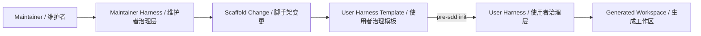
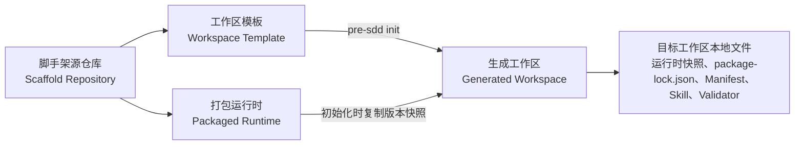

# pre-sdd 脚手架源仓库（Scaffold Repository）

`pre-sdd` 用来生成受执行控制体系（Harness）约束的产品设计（Product Design）与架构设计（Architecture Design）工作区。当前根目录是脚手架源仓库（Scaffold Repository），负责模板、运行时、初始化、测试、打包和发布准备；它不是产品或架构交付工作区。

## 先选择你的视角

| 角色 | 你要做什么 | 从哪里开始 |
|---|---|---|
| 使用者（User） | 安装 `pre-sdd`、创建自己的生成工作区、让智能代理编写产品或架构产物 | [QUICKSTART.md](QUICKSTART.md) |
| 脚手架开发者（Scaffold Developer） | 修改模板、运行时、命令行入口、工程治理或发布包 | 继续阅读本文 |

例如：想为一个新产品创建工作区，应阅读 Quick Start（快速开始）；想修改 `pre-sdd init` 复制哪些文件，应阅读本文并修改 `templates/workspace/`。

## 双 Harness（双治理层）模型

| 治理层 | 服务对象 | 权威位置 | 结果 |
|---|---|---|---|
| Maintainer Harness（维护者治理层） | 脚手架维护者与维护 Agent | 根 `.psp/harness/` | 经过工程门禁的脚手架仓库变更 |
| User Harness（使用者治理层） | 脚手架使用者与工作区 Agent | `templates/workspace/.psp/harness/`，初始化后由目标工作区本地拥有 | 当前工作区内受约束的产品或架构执行 |

两者不形成上下级运行关系。根治理负责生产正确的模板，生成工作区治理负责使用自己的本地事实执行；根治理不能执行用户产物移交，生成工作区也不能反向控制脚手架仓库。



## 开发者视角（Developer View）

### 四个执行上下文



| 上下文 | 物理位置 | 负责什么 | 例子 |
|---|---|---|---|
| 脚手架源仓库（Scaffold Repository） | 仓库根目录 | Maintainer Harness、脚手架工程治理、测试与发布准备 | 校验发布包没有混入根目录运行证据 |
| 工作区模板（Workspace Template） | `templates/workspace/` | 定义新工作区的初始文件 | `pre-sdd init` 会复制其中的 `AGENTS.md` |
| 打包运行时（Packaged Runtime） | `bin/`、`runtime/` | 生成新工作区，并在初始化时写入当前版本的本地运行时快照 | 全局工具更新只影响未来初始化的新工作区 |
| 生成工作区（Generated Workspace） | 使用者执行 `pre-sdd init` 的目标目录 | 保存本地运行时快照、锁定的依赖、业务产物和本地执行事实 | 全局工具升级后仍按自己的运行时快照与 `package-lock.json` 运行 |

关键边界：`templates/workspace/` 是工作区模板（Workspace Template）的唯一事实来源；全局 `pre-sdd` 只负责生成新工作区，既有工作区由 `.psp/runtime/pre-sdd/` 中的初始化版本快照、本地 Node.js 包配置和目标工作区本地文件拥有运行与执行事实。完整架构决策由 [.psp/harness/HARNESS-BOUNDARY.md](.psp/harness/HARNESS-BOUNDARY.md) 统一拥有。

### 仓库结构

```text
pre-sdd/
├─ bin/                         # 命令行入口（Command Entry Point）
├─ runtime/                     # 打包运行时（Packaged Runtime）
├─ templates/workspace/         # 工作区模板（Workspace Template）
├─ tests/package/               # 初始化与发布包测试
├─ .psp/harness/                # 根执行控制体系、清单、解析器和校验器
├─ .agents/skills/              # 仅存放脚手架仓库治理技能
├─ QUICKSTART.md                # 使用者快速开始
└─ README.md                    # 脚手架开发者入口
```

例如，新增一个会出现在所有未来工作区中的说明文件，应修改 `templates/workspace/` 并运行发布包门禁；只修复命令参数解析，应修改 `bin/` 或 `runtime/`。

### 本地准备

Node.js 必须满足 `^20.19.0 || >=22.12.0`。例如，`20.19.0` 与 `22.12.0` 满足要求，`22.11.0` 不满足要求。

```bash
git clone https://github.com/bigsmartben/pre-sdd.git
cd pre-sdd
npm ci
node bin/pre-sdd.mjs --help
```

最后一条命令会同时显示公共初始化入口和 Agent 内部调度入口：

```text
pre-sdd init <已存在目录>
pre-sdd harness <npm-script> [-- <参数>]
```

其中 `pre-sdd harness` 只供 Agent、治理适配器和脚手架测试使用，不属于使用者命令面。

### 修改流程

1. 先确认已有改动，避免覆盖他人的工作。

   ```bash
   git status --short
   ```

2. 用 Resolver（路径解析器）确认预计变更属于哪个范围，并记录返回的验证命令。每个预计变更路径都要重复传入一个 `--path`。

   ```bash
   node .psp/harness/scripts/resolve-validation.mjs \
     --path README.md \
     --path QUICKSTART.md \
     --intent change \
     --json
   ```

3. 只修改本次任务需要的文件。不要在 `templates/workspace/` 原位创建用户实例、`node_modules`、构建输出或浏览器证据。

4. 编辑过程中以 `change` 获得快速反馈；任务或 Issue 完成时以 `checkpoint` 运行定向临时工作区测试；PR、合并或发布前以 `readiness` 执行完整门禁。只有 `readiness` PASS 可以形成 `validated-scaffold-change`。

   ```bash
   node .psp/harness/scripts/resolve-validation.mjs --path <实际路径> --intent checkpoint --json
   node .psp/harness/scripts/resolve-validation.mjs --path <实际路径> --intent readiness --json
   ```

5. 对全部实际变更路径重新运行 Resolver，并按返回顺序执行每条命令。下面是 `readiness` 可能出现的最大门禁集合，不是编辑循环固定执行的四项。

   ```bash
   npm run validate:harness
   npm run test:harness
   npm run test:package
   npm run pack:check
   ```

Resolver 会按实际路径和意图缩小命令集合。例如，修改 Product Design Skill 时，`change` 只运行根结构校验和临时模板副本中的高信号 Product Design 测试，`checkpoint` 再运行临时生成工作区的完整领域套件；`readiness` 仍运行全部四项。

### 变更范围与门禁

| 修改内容 | 常见路径 | `change` / `checkpoint` | `readiness` |
|---|---|---|---|
| 根治理与开发者文档 | `README.md`、`.psp/harness/**` | Harness 结构与治理回归 | 完整发布门禁 |
| 运行时与命令行入口 | `bin/**`、`runtime/**`、`package.json` | Harness 回归 / 包行为检查 | 完整发布门禁 |
| Product Design 模板 | `templates/workspace/.agents/skills/product-design/**` | 临时模板副本 / 临时生成工作区 Product Design 测试 | 完整发布门禁 |
| Architecture Design 模板 | `templates/workspace/.agents/skills/architecture-design/**` | 临时模板副本 / 临时生成工作区 Architecture Design 测试 | 完整发布门禁 |
| 共享工作区模板 | `templates/workspace/**` | 三个临时模板副本 / 三个临时生成工作区定向套件 | 完整发布门禁 |

这里的 `PASS` 只表示脚手架工程门禁通过，不表示任何产品或架构内容已经就绪。

当前根仓库的 Maintainer Handoff（维护者移交）就是“已验证脚手架变更”：维护者取得上述工程证据后决定是否合并。它不是用户内容，也不会生成产品或架构移交凭证。

### 模板与运行时边界

- 模板项目必须保持 `PSPProject` 绑定，所有可用阶段初始状态为 `uninitialized`。
- 产品设计与架构设计领域 Skill 只能存在于 `templates/workspace/.agents/skills/` 和生成工作区中。
- 生成工作区必须通过本地 `package.json` 与 `package-lock.json` 固定运行配置，不自动采用后来更新的全局 `pre-sdd`。
- Agent 内部运行时必须执行生成工作区 Manifest（清单）声明的本地 Executor（执行器）。
- 既有工作区不提供更新或升级操作；全局命令行工具与旧工作区之间不建立跨版本兼容契约。
- 脚手架测试必须在操作系统临时目录中的模板副本或生成工作区上运行。

例如，测试本地执行权时，应先在临时目录初始化工作区，再把该临时工作区的 Validator 改成固定失败；如果命令仍然通过，说明运行时错误地读取了包内模板副本。

### 持续集成与发布检查

持续集成（Continuous Integration）工作流只调用 `.psp/harness/scripts/run-ci-validation.mjs`。该执行器读取 Manifest、让 Resolver 以 `readiness` 覆盖仓库路径，再按返回顺序执行全部工程门禁。只查看本地执行计划时运行：

```bash
node .psp/harness/scripts/run-ci-validation.mjs --plan --json
```

发布前用下面的命令确认 npm 包清单；包中应包含命令入口、运行时、工作区模板、`README.md` 和 `QUICKSTART.md`，不应包含根 `.psp/` 或用户产物。

```bash
npm run pack:check
```

使用者安装和初始化示例统一放在 [QUICKSTART.md](QUICKSTART.md)，避免把脚手架维护命令与工作区使用命令混在一起。
