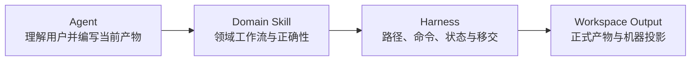

# 生成工作区 Harness 职责边界（Generated Workspace Harness Boundary）

本文件适用于 `pre-sdd init` 创建的 `PSPProject` 工作区。本地 Harness 是 User Harness（使用者治理层），只治理当前生成工作区；它不是脚手架源仓库的 Maintainer Harness，也不反向控制模板、运行时或发布过程。Harness 是与产品语义和内容效果无关的硬治理控制面；领域正确性由工作区本地 Product Design 与 Architecture Design Skill 负责。

## 职责图

| 责任方 | 拥有 | 不拥有 |
|---|---|---|
| Agent（智能代理） | 用户对话、当前范围、内容编写、结果解释 | 路径猜测、绕过门禁、自动推进 |
| Harness（执行控制体系） | 输入输出角色、路径绑定、Scope、依赖、生命周期、命令、验证状态、阻断协议、确定 handoff（移交） | 用户审批、领域语义、内容质量 |
| Domain Skill（领域 Skill） | 工作流、Contract、Schema、模板、投影器、追溯规则、领域 Validator | 项目路径绑定、工程门禁结果、移交授权 |
| Artifact（产物） | 当前阶段正式事实 | Harness 规则、领域工具、下游平台映射 |

例如，“输出必须位于 `psp.project.yaml` 绑定的路径”属于 Harness；“Control（控件）是否关联 Action（动作）”属于 Product Design Skill。

## 公共执行规则

- 路径只从本地 `psp.project.yaml` 解析，不根据目录名称猜测。
- 结构状态只允许 Manifest 声明的生命周期；`uninitialized` 空骨架不是用户实例。
- 工程命令按 Manifest 顺序实际执行；失败后的命令标记为 `NOT_RUN`。
- Harness 原样传递领域 blocker code（阻断码），不解释或修复领域内容。
- handoff 每次重新执行来源和上游 readiness Profile；`PASS` 凭证不持久化用户确认，也不启动下游。
- 当前模板只允许 Manifest 明确声明的工作区内部移交边，不绑定工作区外框架生命周期。

## 本地执行事实

工作区本地 `package.json` 与 `package-lock.json` 是运行配置唯一事实来源；本地 Manifest、领域 Skill、Contract、Schema、模板、渲染器和 Validator 是治理与领域执行唯一事实来源。Agent 必须通过本地 Node.js 包管理器脚本执行当前工作区的 `executor.path`，不得改用包内 `templates/workspace/` 副本。

全局 `pre-sdd` 只负责安装、更新和生成新工作区。当前工作区不提供更新、升级、迁移或同步操作，也不自动采用后来更新的全局运行时；因此不要求新版全局命令行工具兼容本工作区。

例如，用户修改当前工作区 `.agents/skills/product-design/scripts/validate.mjs` 后，下一次 `npm run validate:product` 必须立即采用该修改。

## Harness 不负责

- 不判断 Screen、Component、State、Event、Action 或 Conceptual Model 的领域正确性。
- 不保存用户审批、`currentStep` 或自动推进状态。
- 不规定 SwiftUI、Android、Web 或其他下游平台如何消费 Canonical UI Prototype。
- 不从实现便利性反推或修改产品事实。
