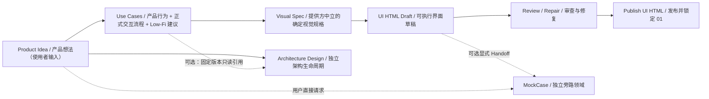
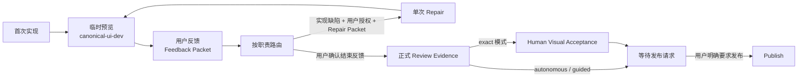
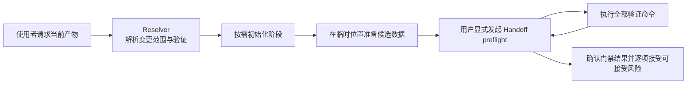

# pre-sdd 生成工作区（Generated Workspace）

此目录由 `pre-sdd init` 创建，是业务交付使用的生成工作区（Generated Workspace），不是 `pre-sdd` 脚手架源仓库（Scaffold Repository）。本地 `psp.project.yaml`、`.psp/harness/` 与 `.agents/skills/` 是当前工作区的治理和领域执行唯一事实来源。

本地 `.psp/harness/` 是 User Harness（使用者治理层）：它只约束当前工作区，不负责维护脚手架模板，也不与其他工作区共享生命周期或运行事实。

## 如何开始

使用者只需告诉 Agent（智能代理）当前要完成的产物，不需要手工调用 Harness（执行控制体系）命令。

例如：

> 请根据这段产品想法整理 Use Cases（用例）：为小型设计团队提供一个可追踪评审意见的协作工具。

Agent 会读取本地项目绑定和 Manifest（清单），只初始化本次需要的阶段，在临时位置准备候选结构化数据，再通过已登记的产物 operation（操作）生成权威 YAML 与面向使用者的 Markdown，最后执行当前范围要求的验证。完成当前产物不会自动开始下游工作；是否继续仍由使用者明确决定。

阶段初始化会创建该阶段登记的全部模型、Markdown 和工程模板，但文件已经存在不等于对应产物已经开始或就绪。例如，使用者第一次请求 Use Cases 时，产品阶段初始化会创建原子 UC、Visual Spec 的 draft 模型及对应 Markdown；Canonical UI 应用仍需后续按 Actor 显式创建。

## 初始状态

工作区初始化只创建三个可独立选择阶段的空目录骨架，不创建用户实例或业务事实。

| Stage（阶段） | Initial Status（初始状态） | Initial Content（初始内容） |
|---|---|---|
| Product Design（产品设计） | `uninitialized`（未初始化） | `.gitkeep` 目录标记 |
| MockCase（可选旁路模拟） | `uninitialized`（未初始化） | `.gitkeep` 目录标记；不预放 Actor、Suite、Evidence 或 Runtime |
| Architecture Design（架构设计） | `uninitialized`（未初始化） | `.gitkeep` 目录标记 |

只有使用者明确开始某一阶段时，Agent 才能执行 Manifest 登记的初始化 operation（操作）。`uninitialized` 的结构验证通过，只表示空骨架有效，不表示任何产物内容就绪。

例如，只请求架构设计时，即使 Product Design（产品设计）仍是 `uninitialized`，也可以独立初始化 Architecture Design。Agent 使用架构本地输入建立边界；如果显式引用 Product Design，只能读取 Package 中记录的固定版本，不能补写产品事实。

## 工作区交付关系



“Product Idea（产品想法）”是使用者提供的输入；进入 Product Design 后形成的第一个权威产物是 Use Cases。`use-cases.yaml` 是机器权威视图，`UC.md` 是唯一人类视图。Architecture Design 不依赖 Product Design 生命周期；它可以完全独立，也可以显式固定一个只读 Use Cases 版本。Canonical UI Prototype 不是架构输入。

每轮只处理使用者明确要求的当前产物。验证结果不会自动触发 handoff（移交）；只有使用者显式请求时才运行 preflight，展示固定来源版本、内容哈希、检查结果和风险，然后等待确认或拒绝。确认后的 Receipt 也始终返回 `downstreamAction: NOT_RUN`。

例如，Use Cases → Visual Spec 同时声明数据 Dependency 和授权 Handoff：普通编辑只检查 Use Cases 当前 Scope；显式一致性分析默认检查下游影响；Handoff preflight 则只检查来源 readiness 与入向 Dependency 闭包，不要求 Visual Spec 或 Canonical UI 已完成。使用者显式确认后才形成授权 Receipt。开始 Architecture Design 不执行 Product Design 验证，也不生成跨生命周期 Receipt。

当前模板只声明工作区内部移交边，不绑定工作区外部框架。架构设计通过本地门禁后形成当前范围的验证结果，后续消费仍需使用者另行明确。

## 权威模型与正式产物

内部模型产物通过一个轻量 artifact operation（产物操作）更新：Agent 在工作区外准备候选 YAML，或为集合产物准备完整候选目录；operation 校验 Schema（结构定义）、生成 Markdown，并用短期文件锁避免同一产物同时写入。它不要求旧版本 hash，也不维护事务恢复状态机；写入未完成时重新运行同一 operation，Validator 会识别尚未同步的投影。Agent 不得直接修改 `.psp/models/` 目标文件或对应 Markdown。UI HTML 是 Area Artifact（目录产物）：HTML、CSS、组件和资源是正式内容；`src/spec/canonical-ui.ts` 只保存 Draft 输入绑定、机器索引和实现映射，隐藏 JSON 是生成支撑，不是独立用户产物。

| 当前产物 | 权威入口 | 正式用户产物 |
|---|---|---|
| Use Cases（原子用例） | `01-product-design/.psp/models/use-cases.yaml`：同时拥有 Product Behavior、正式 Interaction Flow 与内部 Low-Fi UI Blueprint | `01-product-design/UC.md` 确定性呈现三部分 |
| Visual Spec（视觉规格） | `01-product-design/.psp/models/visual-spec.yaml`：提供方中立地定义运行环境、页面、状态渲染、布局、组件状态与 Variant、资源来源和哈希 | `01-product-design/Visual-Spec.md` 确定性呈现全部视觉输入 |
| UI HTML（可执行界面） | `Canonical-UI-Prototypes/<ACTOR-ID>/` 中的 HTML、CSS、组件与资源；`canonical-ui.ts` 是内部机器索引 | 每个参与者目录的可执行界面；`dist`、Review Marker、截图、Repair Packet、Repair Action Report 与 HTTP 地址只是临时过程证据 |
| MockCase（独立旁路模拟） | `MockCase/.psp/models/actors/<ACTOR-ID>/{suite,mockdata,mockcases}.json` 隐藏内部模型集合；Runtime Bundle 可重建 | 浏览器 Review 是用户可见投影；Suite JSON 与 Evidence 不进入用户交付清单 |
| Architecture Design（架构设计） | `02-architecture-design/.psp/models/*.yaml` | `02-architecture-design/README.md`、`02-architecture-design/系统边界.md`、`02-architecture-design/概念建模.md` 与 `02-architecture-design/技术验证/README.md` |

例如，调整一个用例时，Agent 先在临时文件准备包含三部分的完整候选数据，再使用 `apply-product-artifact` 原子提交 `use-cases.yaml` 与 `UC.md`。旧 Wireflow 目录只允许通过显式 `--legacy-wireflow-input` 作为一次性迁移输入；迁移后不会被正常校验、readiness、渲染或 handoff 读取。直接修改目标 YAML/Markdown，或单独运行 `render:product`，都会被视为不符合日常更新协议。Canonical UI 的 `canonical-ui.ts` 合法变化后，使用 `npm run refresh:canonical-ui-projections` 刷新隐藏 JSON；该操作支持 `--dry-run`，只写项目绑定的 `generated-support`，published 阶段必须先 Reopen。

## UC Case、UI Case 与 UI Case Mock

三者属于不同覆盖层，不建立“业务用例必须先生成 Mock”的依赖：

| 固定术语 | 责任 | 例子 |
|---|---|---|
| UC Case（业务路径用例） | 从 Use Case 的 main、alternate、exception 确定派生；只用于业务路径覆盖分析，不形成新产物 | `UC-001-MAIN`、`UC-001-EXC-01` |
| UI Interaction Scenario（界面交互场景） | `canonical-ui.ts.scenarios`；验证控件、事件、迁移与恢复 | “点击提交后进入成功态” |
| Component Visual Case（组件视觉案例） | Visual Spec `visualCases`；声明交互状态 × Variant 的预期视觉 | “Button / hover / primary” |
| UI ViewModel（界面视图模型） | 为一个 Route 的页面组件实例选择合法 State Matrix Entry | “空列表 + 禁用提交按钮” |
| UI Case（界面视觉用例） | `ViewModel + Route + Viewport` 的页面组合态 | “桌面端空列表页” |
| UI Case Mock（界面用例模拟） | 把 UI ViewModel 投影到正式组件，验真状态、变体、属性、Attribute 与 Slot | 切换“加载中页面”并验证截图 |

```text
Use Case ──→ UC Case 只读覆盖
    └──────→ UI Interaction Scenario ──→ 行为与恢复验证

Component Visual Case ──→ State Axes + State Matrix
                                  └──→ UI ViewModel ──→ UI Case ──→ UI Case Mock
```

UI ViewModel 不接受任意原始属性值，只能引用 Component Contract 已声明的合法 Matrix Entry。每个页面实例默认 Entry 和每个有限轴值至少由一个 UI Case 覆盖；完整合法笛卡尔组合仍由 State Matrix 与 State Gallery 穷举。UI Case Mock 是 `$product-design` 的 `$ui-case-mock` 子能力，不拥有 Stage、Artifact、Candidate、Handoff、READY 或独立证据生命周期。模板中的 MSW 网络桩保持独立。

Analyze（分析）、Review（评审）和 Verify（验证）每次只执行一个明确意图。只有明确请求 Review 并使用 `--headed` 才加载 `review=1` 下的 UI Case 工具；浏览器缺失时只返回安装建议，不自动安装。

独立 `$mockcase` 是另一条可选旁路：它拥有自己的 Stage、Domain、隐藏 Suite、Candidate、Runtime Bundle 和 READY/VERIFIED 证据。用户只请求 Analyze 或 Generate 时保持工作区字节级不变；只有显式写操作或明确“端到端完成 MockCase”才允许初始化和写入。Handoff 只生成 `downstreamAction: NOT_RUN` 的授权 Receipt，不会自动启动下游。

```text
MockCase/
└─ .psp/models/actors/ACTOR-001/
   ├─ suite.json
   ├─ mockdata.json
   └─ mockcases.json
```

Review Extension 支持 request、control-event、input 三类 Activation。请求以 Method + Path + Query + Header 一次完整匹配；Input/Select/Textarea value、公开 `textContent`、组件属性、Behavior 和 active Case 都纳入事务快照。例如切换“错误响应”Case 后，退出评审必须恢复原输入值和组件状态，否则返回 `AIH_MOCKCASE_ROLLBACK_FAILED`，不能形成 READY。

## 阶段初始化后的关键结构

产品阶段初始化创建原子 Use Cases 与 Visual Spec 初始模型，以及 Canonical UI 应用集合根，不虚构参与者实例。参与者确定后形成如下结构：

```text
01-product-design/
├─ .psp/models/
│  ├─ use-cases.yaml
│  ├─ visual-spec.yaml
│  └─ canonical-ui-prototypes/
│     ├─ ACTOR-001/canonical-ui-prototype.json
│     └─ ACTOR-002/canonical-ui-prototype.json
├─ UC.md
├─ Visual-Spec.md
├─ inputs/visual-spec/
├─ assets/
└─ Canonical-UI-Prototypes/
   ├─ ACTOR-001/
   │  ├─ src/spec/canonical-ui.ts
   │  └─ package.json
   └─ ACTOR-002/
      ├─ src/spec/canonical-ui.ts
      └─ package.json
```

其中不存在单独的交互模型或产品摘要模型；`use-cases.yaml` 只生成一个面向人的 `UC.md`。

## 旧 Product Package 的迁入策略

本工作区不提供更新、升级、迁移或同步操作；全局 `pre-sdd` 更新不会改写既有工作区。旧工作区继续使用其本地快照。若要把旧内容带入新版工作区，必须新建工作区并显式审查以下映射：

| 旧字段 | 新权威位置 | 冲突处理 |
|---|---|---|
| `overview.productName` | `intent.productName` | 两边名称不同则记录 gap，不自动选边 |
| `overview.productGoal` | `intent.businessGoal` | 已有业务目标不一致时保留两份输入并请求确认 |
| `overview.targetUsers` | `actors[]` | 旧字段是自由文本，必须拆分并确认 Actor，不自动解析后覆盖 |
| `overview.coreValue` | `useCases[].value` | 无法归属具体 Use Case 的内容记录为 gap |

`primaryChain`、`supportingArtifacts`、旧 Product Package gates 和 handoff 信息属于旧治理模型，不迁入产品事实。迁入完成后只能通过 Use Cases 产物 operation 生成新的 `UC.md`，不得从旧摘要文档反向生成用例。

架构阶段可以独立初始化；Product Design 处于未初始化、草稿、已发布或重新打开状态都不控制 02 生命周期。初始化后的关键结构如下：

```text
02-architecture-design/
├─ inputs/
│  ├─ architecture-package/
│  ├─ system-boundary/
│  ├─ conceptual-model/
│  └─ technical-validation/
├─ .psp/models/
│  ├─ architecture-package.yaml
│  ├─ system-boundary.yaml
│  ├─ conceptual-model.yaml
│  └─ technical-validation.yaml
├─ 技术验证/
│  ├─ cases/EXP-001.case.mjs
│  ├─ cases/README.md
│  ├─ src/verify.mjs
│  ├─ package.json
│  └─ README.md
├─ README.md
├─ 系统边界.md
└─ 概念建模.md
```

`inputs/` 保存非权威支撑输入，`.psp/models/` 保存领域权威模型，Markdown 文件是正式用户产物，`技术验证/cases/` 保存真实代码实验；四者不得混用。

## Figma 辅助技能

工作区提供三个职责分离的辅助 Skill（技能）：一个统一 Figma 写回与来源采集工作流、一个 Lit 实现技能和一个实现修复技能。它们可由 Codex 直接发现，但不属于 Product Design 的领域生命周期，不登记 Artifact（产物）或 Handoff（移交）边，也不得反向修改产品事实。

### Canonical UI 用户运行闭环

首次实现、反馈处理、正式 Review（评审）和 Publish（发布）是四个分开的阶段。`$product-design` 拥有反馈路由和生命周期；实现与 Repair Skill（修复技能）只完成各自的一次实现工作。



| 阶段 | 用户看到什么 | 系统行为 | 停止点 |
|---|---|---|---|
| 1. 首次实现 | 可操作的 Lit 页面 | `$implement-canonical-ui` 根据已登记事实实现页面；Figma 来源先由 `$figma-workflow` 完成确认、冻结、采集和登记 | 页面可运行后停止实现 |
| 2. 临时预览与反馈 | `canonical-ui-dev` 输出的 `?review=0` 真实 HTTP 地址 | `$product-design` 将它解释为正式产品 UI 的临时预览地址；需要不一致标记、UI Case 切换器或交互分支驱动器时统一使用 `?review=1`。三个工具都只是 Review Tool，不是产品需求、功能、页面、控件或下游实现 | 提供地址后暂停，等待用户反馈或明确要求结束反馈 |
| 3. 反馈路由与单次修复 | 可追溯的反馈处理结果 | Feedback Packet 只表达反馈。实现类反馈必须先形成机器诊断；用户明确授权后，`$repair-canonical-ui` 才能消费 operation 生成的 Repair Packet，执行一次修改和一次复验 | Repair 后回到临时预览；失败以 `AIH_UI_REPAIR_EXHAUSTED` 停止 |
| 4. 正式 Review 与发布 | Review Evidence（评审证据），通过后显示“可发布” | 只有用户明确表示“结束反馈并生成正式 Review”时才运行 `canonical-ui-review`；`exact` 模式仍要求用户本人完成 Human Visual Acceptance（人工视觉接受），`autonomous` / `guided` 不新增接受记录 | Review 后停止；只有用户另行明确要求才 Publish |

浏览器工具导出的 JSON 是 Feedback Packet，不是 Repair Packet，也不自动授权修复。PNG 只作为可选的人类附件，不嵌入 JSON，也不能替代正式机器截图。固定路由如下：

| Marker 类型 | Category（分类） | 路由目标 |
|---|---|---|
| `interaction` | `behavior` | `use-cases` |
| `visual` | `visual-input` | `visual-spec` |
| `position-size` / `text` | `implementation` | `canonical-ui-prototype` |

正式 Review 可重复接收多个页面包，例如 `npm run review:canonical-ui -- --feedback page-a.json --feedback page-b.json`。无反馈时允许空包；Packet 顺序不会改变 Review ID。旧的 `--markers` 入口不再属于新模板。

以“标题距顶部多 12px”为例：用户框选标题、选择 `position-size`、填写说明并导出 JSON。Product Design 校验 Actor、Draft Version 和路由后，先运行登记门禁；只有门禁生成有效 Repair Packet 且用户明确同意本次修复，Repair Skill 才改一次实现并复验一次。若无法得到确定性诊断，则该条反馈保持未解析，用户需要补充 Visual Spec（视觉规格）或明确预期。

| Skill（技能） | 用途 | 边界 |
|---|---|---|
| `figma-workflow` | 在两次人工确认下完成 Figma 范围扫描、图层整理、组件建模、一次合并写回、最终冻结、来源采集、资源导入和证据封存 | 止于向 Product Design 返回组件抽象提案与登记包；不修改产品事实、视觉策略、Lit 实现或就绪状态 |
| `implement-canonical-ui` | 根据已登记的产品与视觉事实执行首次或规格驱动的 HTML、CSS 与 Lit 实现；覆盖 autonomous、guided、exact 以及无来源、Figma、截图、导出和其他来源 | 只有 Figma 分支要求冻结证据与组件映射；不得自行进入 Repair 或修改产品语义 |
| `repair-canonical-ui` | 在用户明确授权后，根据统一 Repair Packet 对 HTML、CSS、Lit 与组件渲染执行一次有边界的实现修复 | 不拥有临时预览、Review、反馈路由、发布；不修改基线、容差、视觉策略、Mock 数据或业务语义 |

例如，用户要求精准还原一个完整 Figma Frame 时，Agent 先使用 Product Design 确认运行环境、`sourceId`、预期 Page/State/Variant/Screen Binding 和 `exact`（完全实现）视觉策略。`$figma-workflow` 先完成 Page、Group、图片归组、State 与 Variant 的完整审计；第一道人工门禁批准带哈希的写回清单。获批操作执行后重新扫描并保存前后截图，第二道人工门禁验收最终 Figma；只有验收通过才冻结、正式采集并保存原始设计上下文、Component Set 全量定义目录和静态资源。Registration Packet 通过 Component Handshake 把 Figma 组件边界、Property、Variant Axis、Content Region、尺寸行为、全部已定义 Variant 和实际使用的 Instance 闭合后，Product Design 独立登记 Figma ↔ Lit 映射、Variant Definition Coverage（定义覆盖）与 Usage Coverage（使用覆盖）。含视觉内容的 Group 必须作为一个 Asset Boundary 整体导出，CSS 只负责布局和文字排版。最终验收后的来源变化会使旧证据和登记立即失效，并返回 Scan & Audit（扫描审计）。出现来源差异时只由 Repair Packet 驱动独立修复技能修改代码，并用 Repair Action Report 对来源依据和实际修改路径进行交叉校验。像素容差和固定修复原则继续由 Canonical UI Artifact Contract（产物契约）拥有。

## Agent 内部执行流程



以下命令由 Agent 和 Harness Adapter（执行控制适配器）根据使用者意图调用，不是面向使用者的操作接口：

| 目的 | 命令示例 | 前置条件 |
|---|---|---|
| 解析实际变更路径 | `npm run harness:resolve -- --context local-edit --path <仓库相对路径> --json` | 路径使用正斜杠；只调度当前 Scope quick 检查 |
| 初始化产品阶段 | `npm run init:product` | 使用者明确开始产品阶段 |
| 初始化架构阶段 | `npm run init:architecture` | 只要求 Architecture Design 尚未初始化；不检查 Product Design 生命周期 |
| 提交产品内部模型产物 | `npm run apply:product-artifact -- --artifact <id> --input <候选文件>` | 阶段已初始化；可先用同一操作的 `--dry-run` 预检 |
| 提交 Visual Spec | `npm run apply:visual-spec -- --artifact visual-spec --input <候选文件>` | Use Cases 独立 readiness 已通过；引用缺失时稳定阻断 |
| 独立验证 Visual Spec | `npm run validate:visual-spec` | 检查 UC 引用、状态/视口覆盖、Variant 组合、资源路径与 SHA-256 |
| 分析 UC Case 业务覆盖 | `npm run analyze:uc-case-coverage -- --json` | 只读 Use Cases 与 Interaction Flow；不读取 Canonical UI，不写文件 |
| 分析 UI Case 视觉覆盖 | `npm run analyze:ui-case-coverage -- --json` | 默认只读检查全部 Actor；可用 `--actor <ACTOR-ID>` 收窄 |
| UI Case Mock 交互评审 | `npm run review:ui-case-mock -- --actor <ACTOR-ID> --headed` | 仅在明确 Review 意图时启动；不形成独立 READY |
| UI Case Mock 无头验真 | `npm run verify:ui-case-mock` | 默认执行全部 Actor 的 UI Case × Viewport；可用 `--actor <ACTOR-ID>` 收窄 |
| 只读分析 MockCase | `npm run analyze:mockcase -- --actor <ACTOR-ID>` | 可未初始化；不写工作区 |
| 只读生成 MockCase Candidate | `npm run generate:mockcase-candidate -- --actor <ACTOR-ID> [--mockdata <packet>]` | Candidate 放操作系统临时目录；不隐式 Initialize/Apply |
| 初始化并应用 MockCase | `npm run init:mockcase` / `npm run apply:mockcase-candidate` | 仅显式操作或端到端请求；Suite 只写隐藏模型路径 |
| 生成 MockCase Runtime | `npm run project:mockcase-runtime -- --actor <ACTOR-ID>` | 至少 MAPPED；Runtime 是可重建机器投影 |
| MockCase 人工评审 | `npm run review:mockcase -- --actor <ACTOR-ID> --review-url <url> --headed` | 每个 Route 的全部 Case Apply/回滚成功后才形成 READY |
| MockCase 独立验真 | `npm run verify:mockcase -- --actor <ACTOR-ID> --review-url <url>` | 无头逐 Route/Case 比较 dispose 前后公开状态；只此操作形成 VERIFIED |
| 提交架构内部模型产物 | `npm run apply:architecture-artifact -- --artifact <id> --input <候选文件>` | 阶段已初始化；可先用同一操作的 `--dry-run` 预检 |
| 验证产品阶段 | `npm run validate:product` | 按 Resolver 返回顺序执行 |
| 验证架构阶段 | `npm run validate:architecture` | 按 Resolver 返回顺序执行 |
| 刷新 Canonical UI 机器投影 | `npm run refresh:canonical-ui-projections -- --dry-run` | active 阶段；去掉 `--dry-run` 后事务写入 `generated-support` |
| Handoff preflight | `npm run handoff -- --from <来源范围> --to <消费范围> --json` | 用户显式请求；只展示检查、风险与 token |
| 确认 Handoff | `npm run handoff -- --from <来源范围> --to <消费范围> --confirm --actor <主体> --preflight-token <token> --json` | 用户查看 preflight 后明确确认；风险逐项使用 `--accept-risk` |

工作区本地 `package.json` 与 `package-lock.json` 固定运行配置；执行器从当前工作区本地 Manifest 声明的路径加载。本地领域 Skill（能力说明）、Contract（契约）、Schema（结构定义）、模板、渲染器和 Validator（校验器）不得由包内 `templates/workspace/` 副本替代。

本工作区不提供更新、升级、迁移或同步操作。全局 `pre-sdd` 后续更新只影响新初始化的工作区，不得改变当前工作区的运行配置；当前工作区也不依赖新版全局命令行工具兼容旧工作区。

## 职责边界

| Owner（所有者） | Owns（负责） | Does Not Own（不负责） | Example（例子） |
|---|---|---|---|
| Agent（智能代理） | 使用者对话、当前范围、产物编写、结果解释 | 绕过门禁、自动推进 | 使用者只要求 Use Cases 时，不自动开始 Canonical UI Prototype |
| Harness（执行控制体系） | 输入输出、路径、Scope（范围）、依赖、生命周期、命令、状态与移交 | 产品或架构语义 | 检查 Manifest 声明的文件是否存在，不判断产品目标是否合理 |
| Domain Skill（领域能力） | 领域工作流、Contract、Schema、模板、追溯、渲染器和领域 Validator | 使用者审批、阶段推进、路径推断 | 产品设计能力检查用例场景是否完整 |
| UI HTML（可执行界面） | 可执行 HTML/CSS/组件/资源、内部 `canonical-ui.ts` 映射，以及 Review/Publish 领域规则 | 下游平台映射、02 初始化和代码生成规则 | Publish 锁定整个 01，但返回 `downstreamAction: NOT_RUN` |
