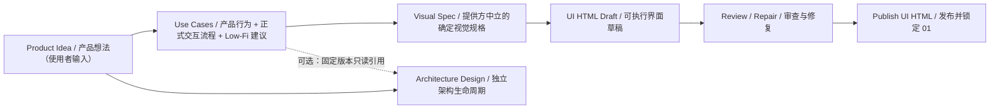
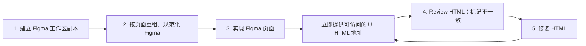
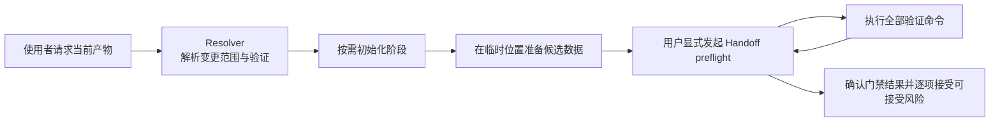

# pre-sdd 生成工作区（Generated Workspace）

此目录由 `pre-sdd init` 创建，是业务交付使用的生成工作区（Generated Workspace），不是 `pre-sdd` 脚手架源仓库（Scaffold Repository）。本地 `psp.project.yaml`、`.psp/harness/` 与 `.agents/skills/` 是当前工作区的治理和领域执行唯一事实来源。

本地 `.psp/harness/` 是 User Harness（使用者治理层）：它只约束当前工作区，不负责维护脚手架模板，也不与其他工作区共享生命周期或运行事实。

## 如何开始

使用者只需告诉 Agent（智能代理）当前要完成的产物，不需要手工调用 Harness（执行控制体系）命令。

例如：

> 请根据这段产品想法整理 Use Cases（用例）：为小型设计团队提供一个可追踪评审意见的协作工具。

Agent 会读取本地项目绑定和 Manifest（清单），只初始化本次需要的阶段，在临时位置准备候选结构化数据，再通过已登记的产物 operation（操作）生成权威 YAML 与面向使用者的 Markdown，最后执行当前范围要求的验证。完成当前产物不会自动开始下游工作；是否继续仍由使用者明确决定。

阶段初始化会创建该阶段登记的全部模型、Markdown 和工程模板，但文件已经存在不等于对应产物已经开始或就绪。例如，使用者第一次请求 Use Cases 时，产品阶段初始化会创建原子 UC、Visual Spec 的 draft 模型及对应 Markdown；Canonical UI 应用仍需后续按 Actor 显式创建。

## 初始状态

工作区初始化只创建两个阶段的空目录骨架，不创建用户实例或业务事实。

| Stage（阶段） | Initial Status（初始状态） | Initial Content（初始内容） |
|---|---|---|
| Product Design（产品设计） | `uninitialized`（未初始化） | `.gitkeep` 目录标记 |
| Architecture Design（架构设计） | `uninitialized`（未初始化） | `.gitkeep` 目录标记 |

只有使用者明确开始某一阶段时，Agent 才能执行 Manifest 登记的初始化 operation（操作）。`uninitialized` 的结构验证通过，只表示空骨架有效，不表示任何产物内容就绪。

例如，只请求架构设计时，即使 Product Design（产品设计）仍是 `uninitialized`，也可以独立初始化 Architecture Design。Agent 使用架构本地输入建立边界；如果显式引用 Product Design，只能读取 Package 中记录的固定版本，不能补写产品事实。

## 工作区交付关系



“Product Idea（产品想法）”是使用者提供的输入；进入 Product Design 后形成的第一个权威产物是 Use Cases。`use-cases.yaml` 是机器权威视图，`UC.md` 是唯一人类视图。Architecture Design 不依赖 Product Design 生命周期；它可以完全独立，也可以显式固定一个只读 Use Cases 版本。Canonical UI Prototype 不是架构输入。

每轮只处理使用者明确要求的当前产物。验证结果不会自动触发 handoff（移交）；只有使用者显式请求时才运行 preflight，展示固定来源版本、内容哈希、检查结果和风险，然后等待确认或拒绝。确认后的 Receipt 也始终返回 `downstreamAction: NOT_RUN`。

例如，Use Cases → Visual Spec 同时声明数据 Dependency 和授权 Handoff：普通编辑只检查 Use Cases 当前 Scope；显式一致性分析默认检查下游影响；Handoff preflight 则只检查来源 readiness 与入向 Dependency 闭包，不要求 Visual Spec 或 Canonical UI 已完成。使用者显式确认后才形成授权 Receipt。开始 Architecture Design 不执行 Product Design 验证，也不生成跨生命周期 Receipt。

当前模板只声明工作区内部移交边，不绑定工作区外部框架。架构设计通过本地门禁后形成当前范围的验证结果，后续消费仍需使用者另行明确。

## 权威模型与正式产物

内部模型产物通过一个轻量 artifact operation（产物操作）更新：Agent 在工作区外准备候选 YAML，或为集合产物准备完整候选目录；operation 校验 Schema（结构定义）、生成 Markdown，并用短期文件锁避免同一产物同时写入。它不要求旧版本 hash，也不维护事务恢复状态机；写入未完成时重新运行同一 operation，Validator 会识别尚未同步的投影。Agent 不得直接修改 `.psp/models/` 目标文件或对应 Markdown。UI HTML 是 Area Artifact（目录产物）：HTML、CSS、组件和资源是正式内容；`src/spec/canonical-ui.ts` 只保存 Draft 输入绑定、机器索引和实现映射，隐藏 JSON 是生成支撑，不是独立用户产物。

| 当前产物 | 权威入口 | 正式用户产物 |
|---|---|---|
| Use Cases（原子用例） | `01-product-design/.psp/models/use-cases.yaml`：同时拥有 Product Behavior、正式 Interaction Flow 与内部 Low-Fi UI Blueprint | `01-product-design/UC.md` 确定性呈现三部分 |
| Visual Spec（视觉规格） | `01-product-design/.psp/models/visual-spec.yaml`：提供方中立地定义运行环境、页面、状态渲染、布局、组件状态与 Variant、资源来源和哈希 | `01-product-design/Visual-Spec.md` 确定性呈现全部视觉输入 |
| UI HTML（可执行界面） | `Canonical-UI-Prototypes/<ACTOR-ID>/` 中的 HTML、CSS、组件与资源；`canonical-ui.ts` 是内部机器索引 | 每个参与者目录的可执行界面；`dist`、Review Marker、截图、Repair Packet、Repair Action Report 与 HTTP 地址只是临时过程证据 |
| Architecture Design（架构设计） | `02-architecture-design/.psp/models/*.yaml` | `02-architecture-design/README.md`、`02-architecture-design/系统边界.md`、`02-architecture-design/概念建模.md` 与 `02-architecture-design/技术验证/README.md` |

例如，调整一个用例时，Agent 先在临时文件准备包含三部分的完整候选数据，再使用 `apply-product-artifact` 原子提交 `use-cases.yaml` 与 `UC.md`。旧 Wireflow 目录只允许通过显式 `--legacy-wireflow-input` 作为一次性迁移输入；迁移后不会被正常校验、readiness、渲染或 handoff 读取。直接修改目标 YAML/Markdown，或单独运行 `render:product`，都会被视为不符合日常更新协议。Canonical UI 的 `canonical-ui.ts` 合法变化后，使用 `npm run refresh:canonical-ui-projections` 刷新隐藏 JSON；该操作支持 `--dry-run`，只写项目绑定的 `generated-support`，published 阶段必须先 Reopen。

## MockCase 旁路垂直域

`mockcase` 是独立、可选的旁路垂直域（Side-path Vertical Domain），不属于 `Use Cases → Visual Spec → Canonical UI` 主流程。它只读 Use Cases 与 Canonical UI，通过用户直接操作或显式 Handoff（移交）进入；Handoff 只生成 Receipt（凭证），不会初始化或写入下游。

每个 Actor 的权威 Suite 由 `suite.json`、`mockdata.json` 和 `mockcases.json` 组成：前者锁定输入和文件摘要，`mockdata.json` 只拥有 Fixture 与网络行为，`mockcases.json` 只拥有 Case 编排和上游公开身份引用。`mockcase-runtime.json` 是可重建的运行投影，不是第四个权威输入。

```text
只读分析当前工作区本地事实
  → 展示覆盖差量、输入哈希和候选哈希
  → 完整性与漂移校验
  → MockCase 的 apply-mockcase-candidate 自动原子应用
  → Resolver 调度结构与运行验证
```

分析和生成候选都不会修改 Use Cases、Scenario、Visual Spec、Canonical UI 或其他正式文件。正式业务事实不足时返回 `AIH_MOCKCASE_UPSTREAM_GAP` 并停止；不得猜测业务分支、响应、文案、组件状态或 Mock Behavior。Mock Behavior 与 Mock Case 分别由独立 Suite 中的 `mockdata.json` 和 `mockcases.json` 持有；Product Design 只提供中性的 Review Host（评审宿主）和公开 DOM 标记，不保存 MockCase 配置。使用者触发 MockCase Skill 后，候选经 Candidate Hash、输入锁和目标摘要校验即可原子应用到目标 Actor Suite，无需二次确认；`canonical-ui.ts` 与 UI HTML 源码必须保持字节级不变。实际依赖或目标 Suite 发生变化时，旧候选以 `AIH_MOCKCASE_CANDIDATE_STALE` 拒绝并自动重新生成。应用成功最多表示映射完成（`MAPPED`），页面运行结果仍需由 MockCase Review Extension（评审扩展）和独立浏览器 Validator（校验器）验证。

例如，可以对 Agent 说：“为 ACTOR-001 补齐支付流程的业务 MockCase，并连续完成生成、应用、可视评审和独立验证；除非缺少无法从权威来源取得的业务事实，否则不要再次询问确认。”

## 阶段初始化后的关键结构

产品阶段初始化创建原子 Use Cases 与 Visual Spec 初始模型，以及 Canonical UI 应用集合根，不虚构参与者实例。参与者确定后形成如下结构：

```text
01-product-design/
├─ .psp/models/
│  ├─ use-cases.yaml
│  ├─ visual-spec.yaml
│  └─ canonical-ui-prototypes/
│     ├─ ACTOR-001/canonical-ui-prototype.json
│     └─ ACTOR-002/canonical-ui-prototype.json
├─ UC.md
├─ Visual-Spec.md
├─ inputs/visual-spec/
├─ assets/
└─ Canonical-UI-Prototypes/
   ├─ ACTOR-001/
   │  ├─ src/spec/canonical-ui.ts
   │  └─ package.json
   └─ ACTOR-002/
      ├─ src/spec/canonical-ui.ts
      └─ package.json
```

其中不存在单独的交互模型或产品摘要模型；`use-cases.yaml` 只生成一个面向人的 `UC.md`。

## 旧 Product Package 的迁入策略

本工作区不提供更新、升级、迁移或同步操作；全局 `pre-sdd` 更新不会改写既有工作区。旧工作区继续使用其本地快照。若要把旧内容带入新版工作区，必须新建工作区并显式审查以下映射：

| 旧字段 | 新权威位置 | 冲突处理 |
|---|---|---|
| `overview.productName` | `intent.productName` | 两边名称不同则记录 gap，不自动选边 |
| `overview.productGoal` | `intent.businessGoal` | 已有业务目标不一致时保留两份输入并请求确认 |
| `overview.targetUsers` | `actors[]` | 旧字段是自由文本，必须拆分并确认 Actor，不自动解析后覆盖 |
| `overview.coreValue` | `useCases[].value` | 无法归属具体 Use Case 的内容记录为 gap |

`primaryChain`、`supportingArtifacts`、旧 Product Package gates 和 handoff 信息属于旧治理模型，不迁入产品事实。迁入完成后只能通过 Use Cases 产物 operation 生成新的 `UC.md`，不得从旧摘要文档反向生成用例。

架构阶段可以独立初始化；Product Design 处于未初始化、草稿、已发布或重新打开状态都不控制 02 生命周期。初始化后的关键结构如下：

```text
02-architecture-design/
├─ inputs/
│  ├─ architecture-package/
│  ├─ system-boundary/
│  ├─ conceptual-model/
│  └─ technical-validation/
├─ .psp/models/
│  ├─ architecture-package.yaml
│  ├─ system-boundary.yaml
│  ├─ conceptual-model.yaml
│  └─ technical-validation.yaml
├─ 技术验证/
│  ├─ cases/EXP-001.case.mjs
│  ├─ cases/README.md
│  ├─ src/verify.mjs
│  ├─ package.json
│  └─ README.md
├─ README.md
├─ 系统边界.md
└─ 概念建模.md
```

`inputs/` 保存非权威支撑输入，`.psp/models/` 保存领域权威模型，Markdown 文件是正式用户产物，`技术验证/cases/` 保存真实代码实验；四者不得混用。

## Figma 辅助技能

工作区提供五个独立辅助 Skill（技能），用于整理、采集、实现和修复 Figma 驱动的 Lit + Vite Canonical UI Prototype。它们可由 Codex 直接发现，但不属于 Product Design 的领域生命周期，不登记 Artifact（产物）或 Handoff（移交）边，也不得反向修改产品事实。

### Figma Quickstart（快速开始）闭环

当工作区已有 Figma 设计时，按以下顺序建立可复查的实现闭环。前 3 步生成实现依据；第 4、5 步持续迭代，直到使用者确认差异已处理。Figma 副本、图层重组和组件创建都属于远端写入，必须先确认目标文件、页面范围和允许的改动。



| 步骤 | 执行要点 | 完成标志 |
|---|---|---|
| 1. 建立 Figma 工作区副本 | 从原始设计复制到本工作区使用的独立副本；保留原始文件作为对照，不在原稿上整理 | 副本、页面范围和责任人已确认 |
| 2. 按页面重组、规范化 Figma | 以待实现页面为单位整理图层与命名，复用已有组件，按需创建规范组件，并标记 `Export/` 资源 | 所有 Figma 写入完成，页面节点已冻结 |
| 3. 实现 Figma | 采集冻结节点的上下文、截图、变量、字体和资源证据，登记组件清单、Figma ↔ Lit 映射与 Variant 覆盖后再实现页面；实现达到可运行状态后立即启动服务 | 可运行的 Canonical UI Prototype、完整来源证据与组件抽象契约，以及已经请求验证并提供给使用者的 UI HTML 地址 |
| 4. Review HTML（审查 HTML） | 在浏览器中对照 Figma 操作页面，使用默认固定在每个页面右上方的不一致标记工具框选差异、选择类别并复制标记截图；剪贴板被拒绝时下载 PNG | 差异形成可执行的修复说明，不改变正式规格 |
| 5. 修复 HTML | 仅按 Repair Packet（修复包）允许的范围修正实现，重新验证并提供当前评审地址；服务重启时提供新的实际地址 | Repair Action Report（修复动作报告）与新一轮可审查页面 |

第 3 步的实现达到可运行状态后必须立即提供 UI HTML 地址，不等待视觉修复、严格检查或正式就绪全部通过。未通过的 safety-structure（安全结构）门禁阻止 Handoff Receipt（移交凭证）；domain-diagnostic（领域诊断）必须作为 residual（剩余问题）展示，只有用户在显式 preflight（预检）后逐项接受，才允许确认 Handoff。第 4、5 步的循环示例：审查时发现“标题距顶部比 Figma 多 12px”，框选标题区域并复制标记截图；修复后重新打开评审地址复查。若仍有差异，继续标记并修复；若无差异，由使用者结束循环。

```text
Product Design 确认 sourceId、业务范围与视觉策略
  → Figma 整理或组件创建（完成全部远端写入）
  → 冻结最终节点并采集设计上下文、截图和变量
  → 导出标记资源并封存 evidence.json 与全部哈希
  → Product Design 绑定来源、业务语义与组件抽象契约
  → Lit + Vite Canonical UI 实现
  → 立即启动服务并提供可访问的 UI HTML 地址
  → Harness 与来源一致性验证（未通过项只阻止正式就绪或移交）
  → Repair Packet 驱动的实现修复
```

| Skill（技能） | 用途 | 边界 |
|---|---|---|
| `capture-figma-design-source` | 在全部 Figma 写入完成后采集节点上下文、截图、变量和字体，导出并校验 `Export/` 资源，再封存资源与哈希证据 | 后续 Figma 写入会使旧证据失效；不决定产品语义、视觉策略或就绪状态 |
| `organize-figma-assets` | 使用 `figma-use` 确认范围后整理图层、复用已有组件并标记 `Export/` 资源 | 不创建新组件；写入后必须重新采集 |
| `figma-component-from-design` | 使用 `figma-use` 与 `figma-generate-library` 确认抽象决定、属性、有限 Variant（变体）和变量后创建 Figma 组件 | 不修改产品事实或阶段状态；写入后必须重新采集 |
| `implement-figma-lit-page` | 使用冻结节点的最终证据与已校验组件映射逐个实现 Lit 组件并组装页面 | 映射缺失或证据过期时停止；不得在页面中重新决定组件边界 |
| `repair-canonical-ui` | 根据统一 Repair Packet 对 HTML、CSS、Lit 与组件渲染执行一次自动修复 | 不修改基线、容差、视觉策略、Mock 数据或业务语义 |

例如，用户要求精准还原一个完整 Figma Frame 时，Agent 先使用 Product Design 确认运行环境、`sourceId` 和 `exact`（完全实现）视觉策略，再完成图层整理或组件创建等全部 Figma 写入。节点冻结后才采集设计上下文和截图、导出静态资源、把每个资源登记为 `role: asset` 并重新计算 `evidence.json` 哈希；Product Design 随后绑定最终来源与业务语义，把每个组件相关节点归类为共享组件、Primitive 或局部结构，并登记 Figma ↔ Lit 映射及使用中 Variant 覆盖，门禁通过后才开始实现。若采集后再次修改 Figma，旧证据立即失效，必须重新采集。出现来源差异时只由 Repair Packet 驱动独立修复技能修改代码，并用 Repair Action Report 对来源依据和实际修改路径进行交叉校验。像素容差和固定修复原则继续由 Canonical UI Artifact Contract（产物契约）拥有。

## Agent 内部执行流程



以下命令由 Agent 和 Harness Adapter（执行控制适配器）根据使用者意图调用，不是面向使用者的操作接口：

| 目的 | 命令示例 | 前置条件 |
|---|---|---|
| 解析实际变更路径 | `npm run harness:resolve -- --context local-edit --path <仓库相对路径> --json` | 路径使用正斜杠；只调度当前 Scope quick 检查 |
| 初始化产品阶段 | `npm run init:product` | 使用者明确开始产品阶段 |
| 初始化架构阶段 | `npm run init:architecture` | 只要求 Architecture Design 尚未初始化；不检查 Product Design 生命周期 |
| 提交产品内部模型产物 | `npm run apply:product-artifact -- --artifact <id> --input <候选文件>` | 阶段已初始化；可先用同一操作的 `--dry-run` 预检 |
| 提交 Visual Spec | `npm run apply:visual-spec -- --artifact visual-spec --input <候选文件>` | Use Cases 独立 readiness 已通过；引用缺失时稳定阻断 |
| 独立验证 Visual Spec | `npm run validate:visual-spec` | 检查 UC 引用、状态/视口覆盖、Variant 组合、资源路径与 SHA-256 |
| 分析 MockCase 业务覆盖 | `npm run analyze:mockcase -- --actor <ACTOR-ID> --json` | 只读当前工作区本地权威输入；可追加 `--route`、`--use-case` 或 `--scenario` |
| 生成 MockCase 候选 | `npm run generate:mockcase-candidate -- --actor <ACTOR-ID> --json` | 只生成确定性 Candidate，不修改正式文件；可用 `--mockdata <json>` 提供明确网络事实 |
| 初始化 MockCase | `npm run init:mockcase -- --actor <ACTOR-ID> --json` | 显式执行 `uninitialized → active` 并创建空 Suite；可选 Receipt 只验证来源 |
| 应用 MockCase 候选 | `npm run apply:mockcase-candidate -- --actor <ACTOR-ID> --input <candidate.json> --json` | 用户触发 Skill 后无需再次确认；Candidate Hash、输入锁与目标摘要仍作为完整性/并发锁，Actor 级锁原子提交三个权威 JSON |
| 生成运行投影 | `npm run project:mockcase-runtime -- --actor <ACTOR-ID> --json` | 确定性生成 `mockcase-runtime.json` |
| 评审 / 独立验证 | `npm run review:mockcase -- ... --headed` / `npm run verify:mockcase ...` | 可视 Review 只有在页面内点击“完成评审”后形成 READY；独立无头浏览器 Validator 才形成 VERIFIED |
| 提交架构内部模型产物 | `npm run apply:architecture-artifact -- --artifact <id> --input <候选文件>` | 阶段已初始化；可先用同一操作的 `--dry-run` 预检 |
| 验证产品阶段 | `npm run validate:product` | 按 Resolver 返回顺序执行 |
| 验证架构阶段 | `npm run validate:architecture` | 按 Resolver 返回顺序执行 |
| 刷新 Canonical UI 机器投影 | `npm run refresh:canonical-ui-projections -- --dry-run` | active 阶段；去掉 `--dry-run` 后事务写入 `generated-support` |
| Handoff preflight | `npm run handoff -- --from <来源范围> --to <消费范围> --json` | 用户显式请求；只展示检查、风险与 token |
| 确认 Handoff | `npm run handoff -- --from <来源范围> --to <消费范围> --confirm --actor <主体> --preflight-token <token> --json` | 用户查看 preflight 后明确确认；风险逐项使用 `--accept-risk` |

工作区本地 `package.json` 与 `package-lock.json` 固定运行配置；执行器从当前工作区本地 Manifest 声明的路径加载。本地领域 Skill（能力说明）、Contract（契约）、Schema（结构定义）、模板、渲染器和 Validator（校验器）不得由包内 `templates/workspace/` 副本替代。

本工作区不提供更新、升级、迁移或同步操作。全局 `pre-sdd` 后续更新只影响新初始化的工作区，不得改变当前工作区的运行配置；当前工作区也不依赖新版全局命令行工具兼容旧工作区。

## 职责边界

| Owner（所有者） | Owns（负责） | Does Not Own（不负责） | Example（例子） |
|---|---|---|---|
| Agent（智能代理） | 使用者对话、当前范围、产物编写、结果解释 | 绕过门禁、自动推进 | 使用者只要求 Use Cases 时，不自动开始 Canonical UI Prototype |
| Harness（执行控制体系） | 输入输出、路径、Scope（范围）、依赖、生命周期、命令、状态与移交 | 产品或架构语义 | 检查 Manifest 声明的文件是否存在，不判断产品目标是否合理 |
| Domain Skill（领域能力） | 领域工作流、Contract、Schema、模板、追溯、渲染器和领域 Validator | 使用者审批、阶段推进、路径推断 | 产品设计能力检查用例场景是否完整 |
| UI HTML（可执行界面） | 可执行 HTML/CSS/组件/资源、内部 `canonical-ui.ts` 映射，以及 Review/Publish 领域规则 | 下游平台映射、02 初始化和代码生成规则 | Publish 锁定整个 01，但返回 `downstreamAction: NOT_RUN` |
